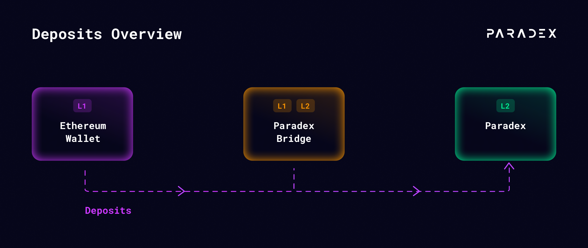
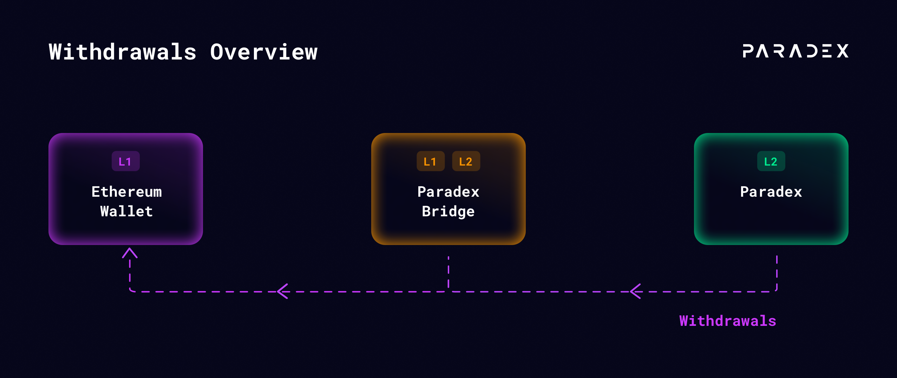

## Deposits

Initiate a deposit from your Ethereum wallet to the Starknet bridge and it will automatically be sent to Paraclear. These transactions may take several minutes depending on network conditions.

**Initiate a Deposit to the Paradex Bridge**

1. Navigate to the **“**[**Portfolio**](https://app.paradex.trade/portfolio)**”** tab in the webapp and connect your wallet (MetaMask or other supported wallet)
2. Click the **“Deposit”** button and enter the amount of funds you wish to transfer to Paradex.

<Info>
Note: This action will require 1-2 L1 signatures. If this is your first deposit to Paradex you will need to enable ERC-20 token transfers and set a spending cap for USDC to the Paradex bridge. If you already have an allowed spending limit set for this token, you can skip this step.
</Info>

3. Confirm the transaction in MetaMask to send USDC to the Paradex bridge contract by selecting **“Initiate Deposit to Bridge”.**
4. Wait for L1 Confirmation:
   * Wait for the L1 deposit transaction to be confirmed on the Ethereum blockchain. This may take a few minutes depending on network conditions.
   * Once confirmed, your funds will automatically be sent from the bridge to Paraclear
5. Start Trading!

## Withdrawals

Initiate a withdrawal from your Paradex account to the Starknet bridge and it will automatically be sent to your L1 once it is available.

**Initiate a Withdrawal to the Paradex Bridge**

1. Navigate to the **“**[**Portfolio**](https://app.paradex.trade/portfolio)**”** tab in the webapp and connect your wallet (MetaMask or other supported wallet)
2. Click the **“Withdraw”** button and enter the amount of funds you wish to transfer from Paradex.
3. Click **“Initiate Withdrawal to Bridge”**.
4. Wait for L1 Confirmation:
   * Wait for the L1 withdrawal transaction to be confirmed on the Ethereum blockchain. Once confirmed, the deposit status will update to **“Available - L1”** in the “Deposit / Withdrawals” table.
   * Once funds are available on L1, we will complete the transfer of your funds from the bridge to your wallet automatically.

<Warning>
Note: "Pending - L2" status can take up to 16 hours to update.

Withdrawing funds requires all preceding actions from all accounts (including risk checks) be validated on Ethereum (L1). Your Paradex (L2) withdrawal transaction will be batched along with other Paradex (L2) transactions (trades, deposits, withdrawals, etc) and sent to the Starknet Prover to generate a Proof guaranteeing the calculations. Batching and proving can take several hours depending on the volume of trades / transactions processed by Paradex (L2) and generating a Starknet proof takes around 2 hours. Once the proof is generated it is sent to the Starknet (L1) verifier contract which will confirm its validity and then unlock funds for withdrawal.
</Warning>
   
5. Withdrawal complete!
