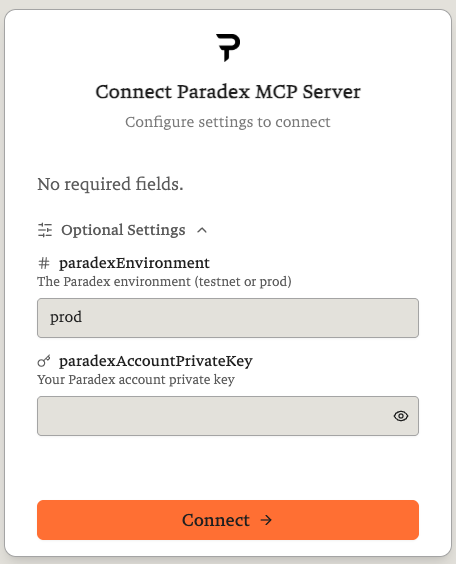

# Claude Desktop

<Note>
Complete the [Getting Started](/agentic-ai-hub/mcp/getting-started) steps (install Python, uvx, and get your private key) before continuing.
</Note>

## Local MCP Setup

<Steps>
  <Step title="Open the config file">
    Open Claude Desktop → **Settings → Developer → Edit Config**. This opens the config file path directly. Find and open `claude_desktop_config.json` with your text editor.

    If the config file doesn't exist yet, create it at the appropriate path:

    - **macOS**: `~/Library/Application Support/Claude/claude_desktop_config.json`
    - **Windows**: `%APPDATA%\Claude\claude_desktop_config.json`
  </Step>
  <Step title="Add the Paradex MCP server">
    Paste the following into the config file. Replace `your_private_key_here` with your actual key from the Getting Started page:

    ```json
    {
      "mcpServers": {
        "paradex": {
          "command": "uvx",
          "args": ["mcp-paradex"],
          "env": {
            "PARADEX_ENVIRONMENT": "prod",
            "PARADEX_ACCOUNT_PRIVATE_KEY": "your_private_key_here"
          }
        }
      }
    }
    ```
  </Step>
  <Step title="Restart Claude Desktop">
    It will automatically download and start the MCP server via `uvx` — no separate install needed.
  </Step>
</Steps>

### Verify It's Working

Click the **+** icon in the bottom-left of the chat input → **Connectors**. You should see **mcp paradex** listed with its toggle enabled.


Then ask Claude:

> "What markets are available on Paradex?"

If you get a list of trading pairs, you're all set. To test trading access:

> "Show me my Paradex account summary."

### Troubleshooting

**Tools not appearing / MCP not loading**
- Make sure `uvx` is installed: `uvx --version`
- Check that the config file has valid JSON (no trailing commas)
- Restart Claude Desktop after config changes

**Authentication errors**
- Double-check your private key is correct and starts with `0x`
- Verify `PARADEX_ENVIRONMENT` matches where your account was created (`prod` or `testnet`)

**`uvx: command not found`**
```bash
pip install uv
# or on macOS:
brew install uv
```

**Want to test without a private key first?** Market data tools work without any credentials. Just omit `PARADEX_ACCOUNT_PRIVATE_KEY` from the config.

## Paradex-hosted MCP

<Warning>
This setup does **not support trading** at the moment. Only public market data is available.
</Warning>

### Via URL

<Steps>
  <Step title="Open Claude Desktop settings">
    Open Claude Desktop → **Settings → Integrations** (or **Settings → Connectors**).
  </Step>
  <Step title="Add a new MCP server">
    Enter `https://mcp.paradex.trade/mcp`.
  </Step>
</Steps>

### Via Smithery

**Option A — Website:**

<Steps>
  <Step title="Find the Paradex server">
    Visit [smithery.ai](https://smithery.ai) and search for **Paradex**.
  </Step>
  <Step title="Select and configure">
    Select the Paradex MCP server, choose **Claude Desktop** as your client.
  </Step>
  <Step title="Connect">
    Configure your settings and click **Connect**.
  </Step>
</Steps>

**Option B — CLI:**

Run this in your terminal:

```bash
npx -y @smithery/cli@latest mcp add @tradeparadex/mcp-paradex-py --client claude
```

You will be required to create an account or sign in to Smithery. Once signed in, a browser window opens with configuration settings — no fields are required, leave `paradexAccountPrivateKey` empty (trading is not supported in this mode). Click **Connect**.



### Verify It's Working

Ask Claude:

> "What markets are available on Paradex?"

If you get a list of trading pairs, you're connected. Note that trading features are not available with this setup.
