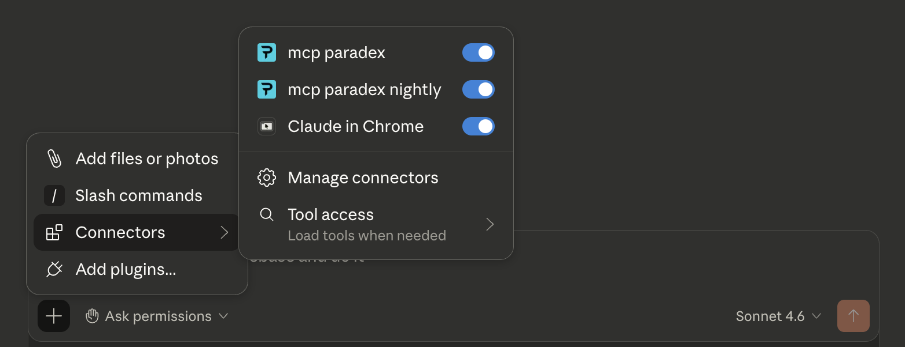

<Steps>
### Open the config file

Open Claude Desktop → **Settings → Developer → Edit Config**. This opens the config file path directly. Find and open `claude_desktop_config.json` with your text editor.

If the config file doesn't exist yet, create it at:
- **macOS**: `~/Library/Application Support/Claude/claude_desktop_config.json`
- **Windows**: `%APPDATA%\Claude\claude_desktop_config.json`

### Add the Paradex MCP server

Paste the following into the config file. Replace `your_private_key_here` with your actual key:

```json
{
  "mcpServers": {
    "paradex": {
      "command": "uvx",
      "args": ["mcp-paradex"],
      "env": {
        "PARADEX_ENVIRONMENT": "prod",
        "PARADEX_ACCOUNT_PRIVATE_KEY": "your_private_key_here"
      }
    }
  }
}
```

### Restart Claude Desktop

Claude Desktop will automatically download and start the MCP server via `uvx`.

Click the **+** icon in the bottom-left of the chat input → **Connectors**. You should see **mcp paradex** listed with its toggle enabled.



### Verify it's working

<Markdown src="../../../snippets/verify-connection.mdx" />

To test trading access, ask:

> "Show me my Paradex account summary."

</Steps>
