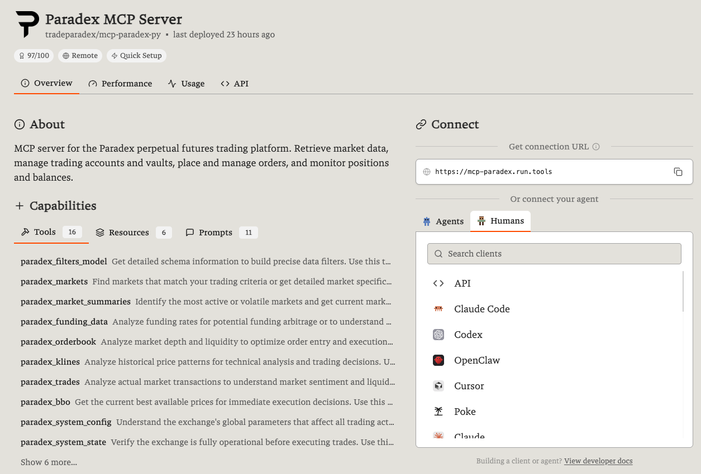

# Paradex-hosted MCP

The simplest way to get started — connect directly to the Paradex-hosted MCP server with no local install or cloud deployment.

<Warning>
This setup does **not support trading** at the moment. Only public market data is available. For full API access including trading, use a [local setup](/agentic-ai-hub/mcp/quickstart).
</Warning>

## Via URL

If your AI client supports adding MCP servers by URL, connect directly with:

```
https://mcp.paradex.trade/mcp
```

### Claude.ai (Web)

<Steps>
  <Step title="Open Settings">
    Open [claude.ai](https://claude.ai) → **Settings → Integrations**.
  </Step>
  <Step title="Add MCP Server">
    Click **Add MCP Server**.
  </Step>
  <Step title="Enter the URL">
    Enter `https://mcp.paradex.trade/mcp`.
  </Step>
</Steps>

### ChatGPT Desktop

<Steps>
  <Step title="Enable Developer Mode">
    Open ChatGPT Desktop → **Settings → Advanced → Developer Mode** (enable if not already).
  </Step>
  <Step title="Add the server">
    Go to **Settings → Connectors → Create**.
  </Step>
  <Step title="Connect">
    Enter `https://mcp.paradex.trade/mcp` and click **I trust this provider**.
  </Step>
</Steps>

### Other Clients

Most clients that support remote MCP servers will accept the URL `https://mcp.paradex.trade/mcp` in their MCP or connector settings. Refer to your client's documentation for the exact location.

## Via Smithery

Smithery provides a guided setup experience for connecting MCP servers to your AI client.

<Steps>
  <Step title="Find the Paradex server">
    Visit [smithery.ai](https://smithery.ai) and search for **Paradex**.
  </Step>
  <Step title="Select the server">
    Select the Paradex MCP server.

    
  </Step>
  <Step title="Choose your client and connect">
    Choose your AI client from the list (Claude Code, Cursor, Codex, and more are supported). Follow the guided setup. No fields are required — leave `paradexAccountPrivateKey` empty (trading is not supported in this mode). Click **Connect**.
  </Step>
</Steps>

## Verify It's Working

Ask your AI assistant:

> "What markets are available on Paradex?"

If you get a list of trading pairs, you're connected.
