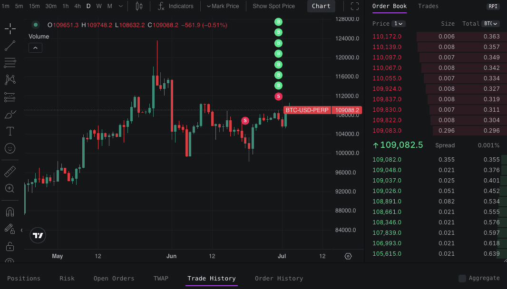
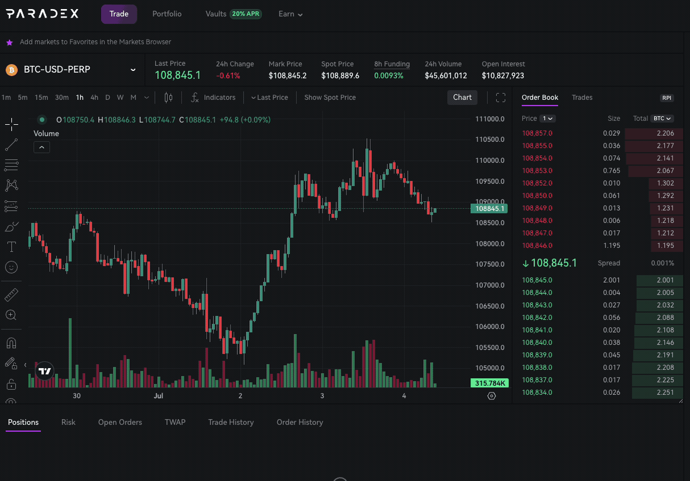
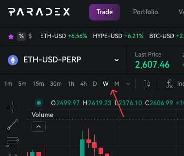

## Aggregate multiple fills on trade history

Track your trades more easily with our new fill aggregation feature.
When a single order results in multiple partial fills, you can now view them as one consolidated entry instead of cluttered individual fills.

Toggle between detailed and consolidated views using the "Aggregate" option in your Trade History tab and TradingView chart.

Thanks to [@vladkens](https://discord.com/channels/1107916848193863740/1263859118318420031/1387885711482425586) for suggesting this improvement.

## Resizable charts on trade page

Manage more positions without scrolling by resizing your charts. 
You can now drag the chart/order book section to reduce chart height and create more screen space for your position management.
Simply drag the divider between sections to adjust the layout to your preference.

Thanks to [@vladkens](https://discord.com/channels/1107916848193863740/1263859118318420031/1387885711482425586) for suggesting this improvement.

## Weekly and monthly chart timeframes

Perform technical analysis more efficiently with new 1W and 1M quick filters added to TradingView charts.

Thanks to [@theLKstyles](https://x.com/theLKstyles/status/1940062549405573553) for suggesting this improvement.

## Bug fixes & improvements

- Increased spread precision to 3 digits
- Added Greeks and Contract Detail tabs to mobile app
- Improved WalletConnect connection recovery after failed connection
- Fixed bug preventing Privy authenticated accounts from depositing
