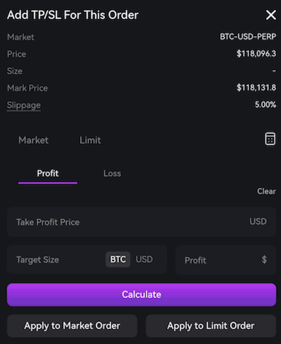
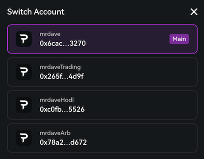
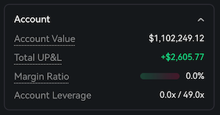
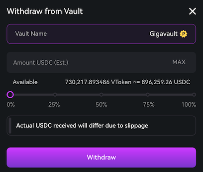

## Calculate Size in TPSL

You can now specify your desired risk amount in dollars when setting TPSL orders,
and the system will automatically calculate the appropriate position size.
This eliminates the need to manually calculate position sizing or use external tools to determine how much you'll risk on each trade.

Thanks to [@warren_muppets](https://x.com/warren_muppets/status/1937533397418803578) for suggesting this improvement.

## Display usernames in Switch Account modal

Account usernames now display in the Switch Account modal (alongside wallet addresses) and main account menu (top-right corner).
This makes it easier to identify and switch between different accounts and sub-accounts without relying solely on wallet addresses for identification.

Thanks to [@therealzerve](https://discord.com/channels/1107916848193863740/1263859118318420031/1391128789202763828) for suggesting this improvement.

## Portfolio and Account Summary now show Total UP&L

Portfolio and Account Summary previously displayed only account balance and unrealized trading P&L,
excluding unrealized funding which is critical for portfolio assessment and order planning.
These sections now show Total Unrealized P&L, combining both unrealized trading P&L and unrealized funding for complete portfolio visibility.

Thanks to [@addr1kajjuw8l6p3ndl](https://discord.com/channels/1107916848193863740/1263859118318420031/1391656078940573716) for suggesting this improvement.

## Withdraw vault tokens in USDC terms

Vault withdrawals now allow you to specify the target amount in USDC rather than vault tokens (vTokens).
This eliminates the need to manually calculate vToken amounts and makes withdrawals more intuitive,
though the final USDC amount may vary slightly due to slippage.

Thanks to [@vukt97](https://discord.com/channels/1107916848193863740/1263859118318420031/1391057755581841558) for suggesting this improvement.

## Bug fixes & improvements

- Added chart resizing by dragging the bottom border up/down
- Aggregated RPI orders in order book UI
- Fixed External EWMA utilization in Mark Price calculation
