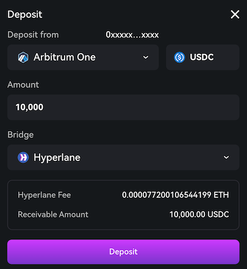
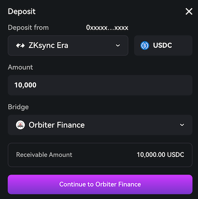
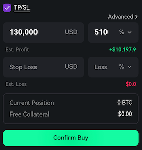

## Interchain Deposits powered by Hyperlane (Beta)

USDC deposits are now supported from Solana, Ethereum, Arbitrum, Base, and Starknet through Hyperlane's permissionless interoperability protocol.
This initial release focuses on deposits with a $250,000 liquidity cap during the testing phase.
Withdrawal support and additional networks will be added following successful testing,
with Paradex Vault tokens also being upgraded for full multi-chain compatibility in the coming weeks.

## Bridge using Orbiter Finance

Added Orbiter Bridge support for deposits and withdrawals across 17 blockchain networks.
This provides an additional bridging option alongside existing methods (Paradex Bridge, Layerswap, RhinoFi, and Hyperlane)
for transferring funds to and from the platform.

## Estimated P&L in TP/SL order builder

Estimated profit/loss amounts in dollars now display directly within the Take Profit/Stop Loss section of the order builder's basic view.
This information was previously available elsewhere but is now shown inline to reduce navigation and provide immediate P&L visibility
when setting TP/SL levels.

Thanks to [@c45p4r](https://discord.com/channels/1107916848193863740/1263859118318420031/1391806445602865343) for suggesting this improvement.

## Bug fixes & improvements

- View positions from Trade Summary page without navigating to separate screen (mobile)
- Apply default max slippage per market when user hasn't configured custom slippage settings
