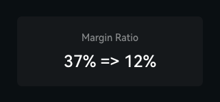
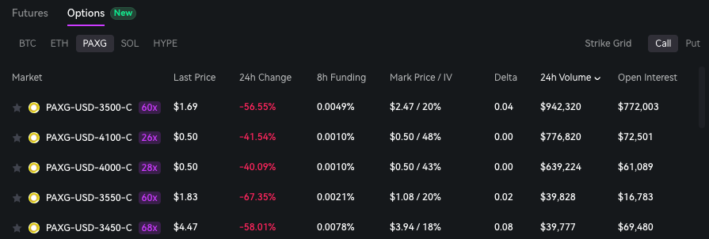
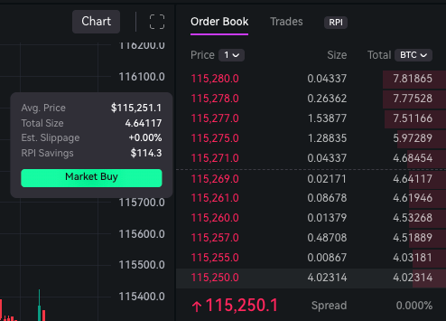

## Portfolio Margin (Invite Only Beta)

We've launched Portfolio Margin in invite-only beta, a sophisticated risk management system that evaluates your entire portfolio holistically rather than each position independently.
By recognizing correlations and hedged positions, it typically reduces margin requirements while providing a more accurate reflection of your portfolio's true risk profile.
This feature is ideal for active traders, options strategists, and sophisticated users seeking improved capital efficiency.

## PAXG Perp Options

We've added PAXG (Pax Gold) perpetual options to our platform, expanding beyond our existing BTC, ETH, SOL, and HYPE markets.
As our first lower volatility perpetual options market, PAXG opens up new strategic opportunities for traders looking to explore options
strategies in a more stable underlying asset tied to gold prices. This addition provides diversification for options traders seeking exposure beyond high-volatility crypto assets.

## RPI Savings on Orderbook

We've added a Retail Price Improvement (RPI) savings popup to the orderbook that displays estimated slippage and RPI savings when you hover over orders,
allowing you to quantify the price improvement you receive when trading on Paradex.

## Bug fixes & improvements

- Mobile Markets Menu now includes sortable Open Interest, 24h Volume, and Funding Rate data for easier market assessment
- TWAP orders now have access to RPI liquidity ([@stochasticfranklin](https://discord.com/channels/1107916848193863740/1263859118318420031/1395621485217054760))
- Fixed bug where TPSL market order fails when set too close to liquidation price
