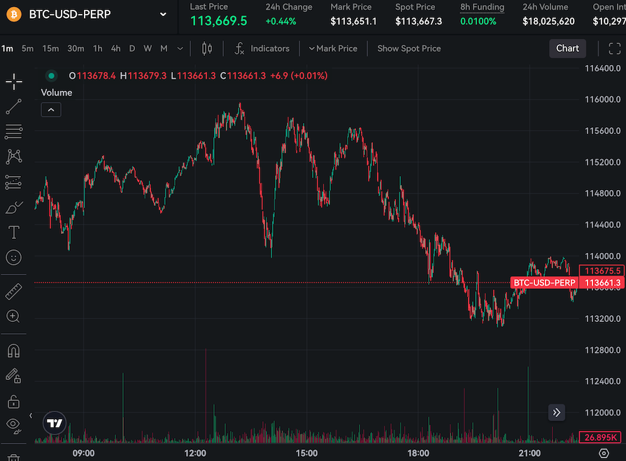
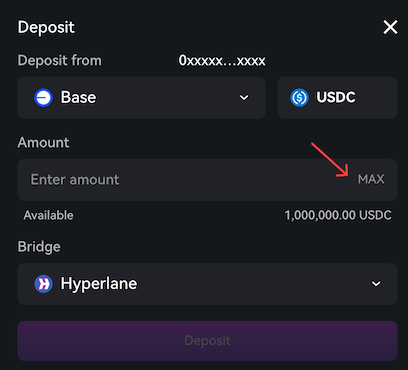
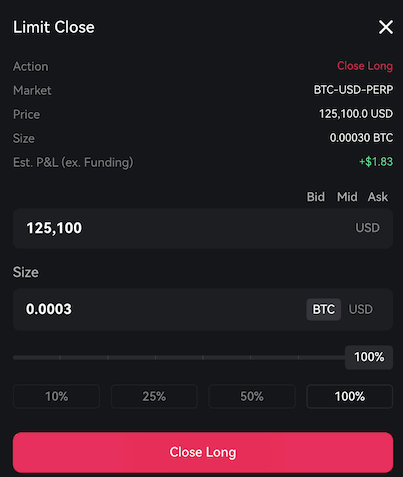

## Volume on Mark Price Chart

Volume data is now available on both mark price and last price charts. 
You can now switch between mark price and last price views while maintaining full volume visibility for comprehensive chart analysis.

Thanks to [@c45p4r](https://discord.com/channels/1107916848193863740/1263859118318420031/1397270090445230265) for suggesting this improvement.

## Deposit Max USDC

Click "Max" to auto-fill your entire USDC balance instead of typing amounts, reducing the time it takes to get back to trading.
USDC balances for accounts on all chains are now visible in the deposit modal. This was previously limited to the Ethereum network.

Thanks to [@manifestryker](https://discord.com/channels/1107916848193863740/1263859118318420031/1395711695925805077) for suggesting this improvement.

## Bid/Ask/Mid buttons for closing limit order modal

Added Bid, Ask, and Mid buttons to the close limit order modal. 
Click any button to auto-fill the price field with current market data.

Thanks to [@imridam](https://discord.com/channels/1107916848193863740/1263859118318420031/1398927806989336636) for suggesting this improvement.

## Bug fixes & improvements

- Searchable market alias (Gold for PAXG Options)
- Fixed order size slider calculations
- RPI savings calculation now adjusts for aggregated RPI pricees
