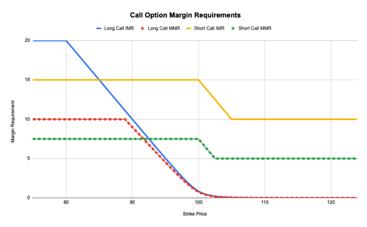
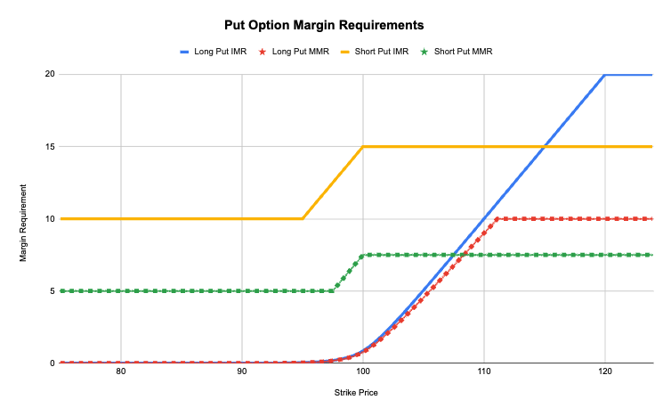

## Contract Specifications

| Features                      | Value                                                |
| ----------------------------- | ---------------------------------------------------- |
| Product Type                  | Perpetual Option                                     |
| Symbol                        | BTC-USD-_{Strike}_-_{Type}_ (e.g. `BTC-USD-60000`-C) |
| Settlement Currency           | USDC                                                 |
| Base Currency                 | BTC                                                  |
| Quote Currency                | USD                                                  |
| Funding Period                | 24 hours                                             |
| Price Tick Size               | 0.01 USD                                             |
| Order Size Increment          | 0.001 BTC                                            |
| Minimum Order Value           | 50 USD                                               |
| Maximum Order Size            | 20 BTC                                               |
| Maximum Number of Open Orders | 100                                                  |
| Position Limit                | 10 BTC                                               |
| Spot Band Factor              | 30%                                                  |
| IV Band Factor                | 30%                                                  |
| Strike Listing Range          | 10%                                                  |
| Strike Delisting Range        | 25%                                                  |

## Mark Price Parameters

| Parameter      | Value |
| -------------- | ----- |
| IV EWMA Factor | 20%   |
| Max IV         | 500%  |

## Cross Margin Parameters

| Parameter              | Value |
| ---------------------- | ----- |
| Premium Multiplier IMF | 100%  |
| Long ITM IMF           | 20%   |
| Short ITM IMF          | 15%   |
| Short OTM IMF          | 10%   |
| Short Put Cap IMF      | 50%   |
| Premium Multiplier MMF | 50%   |
| Long ITM IMF           | 10%   |
| Short ITM IMF          | 7.5%  |
| Short OTM MMF          | 5%    |
| Short Put Cap MMF      | 50%   |

IMF = Initial Margin Fraction

MMF = Maintenance Margin Fraction

**Order Value →** Order Size x Spot Oracle Price (i.e. underlying spot notional)

**Spot/IV Band Factors →** As opposed to perpetual futures where we have 1 single price band factor, 2 factors are needed (both spot and IV are shocked to get the price band)

## Cross Margin Requirements

Options margin requirements in cross margin mode depend on :

- **Side (Buy/Sell)**
- **OTM Amount** : Distance from Spot Price for Out-Of-Money options
- **Spot Price**
- **Option (Mark) Price**

Example of Option Cross Margin Parameters :

| **Fraction Parameter**                               | **Initial Margin**                  | **Maintenance Margin**             |
| ---------------------------------------------------- | ----------------------------------- | ---------------------------------- |
| **Premium Multiplier**                               | `premium_multiplier_imf` **= 100%** | `premium_multiplier_mmf` **= 50%** |
| **Long ITM Fraction**                                | `long_itm_imf` **= 20%**            | `long_itm_mmf` **= 10%**           |
| **Short ITM Fraction**                               | `short_itm_imf` **= 15%**           | `short_itm_mmf` **= 7.5%**         |
| **Short OTM Fraction**                               | `short_otm_imf` **= 10%**           | `short_otm_mmf` **= 5%**           |
| **Short Put Cap** _(Max percentage of Strike Price)_ | `short_put_cap_imf` **= 50%**       | `short_put_cap_mmf` **= 50%**      |

_Note :_ The parameter values above are examples. The parameters will be configurable by underlying asset.

**Margin Requirement :**

**Buy :** $\min(\text{Premium Multiplier}*\text{Option Mark Price},~\text{long\_itm}*\text{Spot Price})$

_Example :_ Spot Price = 100 and User is long 1 option :

If Option Mark Price = 10 → IMR = Option Mark Price = $11 and MMR = $10

If Option Mark Price = 30 → IMR = 20% x Spot Price = $20 and MMR = 10% x Spot Price = $10

**Sell :** $\max(\text{short\_itm}~*~\text{Spot Price}-\text{OTM~Amount},~\text{short\_otm}~*~\text{Spot Price})$

where :

$$
\begin{equation*}
  \text{OTM~Amount} =
    \begin{cases}
      \max(0,~\text{Strike Price}-\text{Spot Price}) & \text{for a call option}\\
      \max(0,~\text{Spot Price}-\text{Strike Price}) & \text{for a put option}
    \end{cases}
\end{equation*}
$$

_Example :_ Spot Price = 100 and User is short 1 option :

- OTM Call Option with Strike Price = 105
  - OTM Amount = $5
  - IMR = max(40-5, 25) = 35
  - MMR = max(20-5, 12.5) = 15
- ITM Put Option with Strike Price = 105
  - OTM Amount = $0
  - IMR = max(40, 25) = 40
  - MMR = max(20, 12.5) = 20

Note that margin requirements for a short put option are capped by : $\text{short\_put\_cap}*\text{Strike Price}$. This is a protection for put margin requirement from being excessively high compared to the strike price which is the maximum theoretical price of the put option.

_Example :_ Spot Price = 100 and User is short 1 put option :

- OTM Put Option with Strike = 40 and Option Mark Price = 25
  - IMR = min(short*otm_imf * Spot Price, short*put_cap_imf * Strike Price) = min(25, 20) = 20
  - MMR = min(short*otm_mmf * Spot Price, short*put_cap_mmf * Strike Price) = min(12.5, 20) = 12.5

The plots below show the call and put margin requirement charts across different strikes :

<Frame caption="Call Option Margin Requirement">
  
</Frame>
<Frame caption="Put Option Margin Requirement">
  
</Frame>
