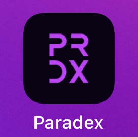
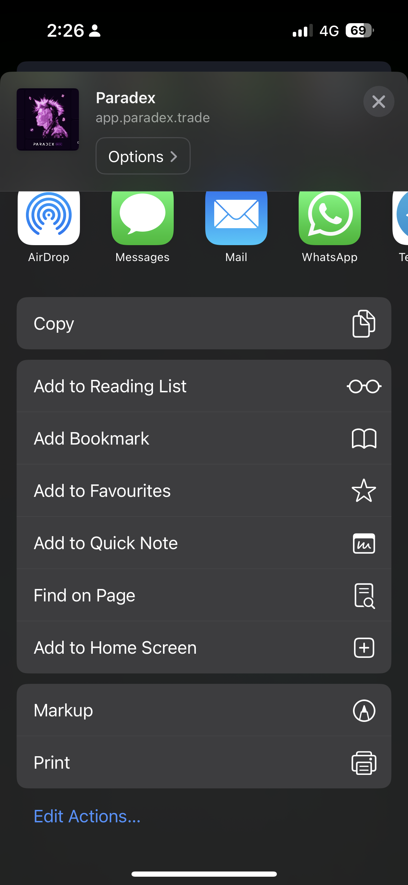

## iOS (Safari / Chrome)

* Step 1: Head over to [https://app.paradex.trade/](https://app.paradex.trade/trade/BTC-USD-PERP)
* Step 2: Click on the  share button at the bottom of your phone screen
* Step 3: Select "Add to Home Screen" 
* Step 4: You would now see the Paradex App added to your phone screen 

<Frame caption="Click on the 'Share' button and select 'Add to Home Screen'">

</Frame>

## Android (Chrome)

* Step 1: Head over to [https://app.paradex.trade/](https://app.paradex.trade/trade/BTC-USD-PERP)
* Step 2: Click on the  3-dot icon at the top right hand corner of your screen
* Step 3: Select "Add to Home Screen" 
* Step 4: Select "Install"
* Step 5: You would now see the Paradex App added to your phone screen 

<Frame caption="Click on the 3-dot menu icon at the top right of your screen. Select 'Add to Home Screen'">

</Frame>
<Frame caption="Select 'Install'">

</Frame>
<Frame caption="Install the Paradex App">

</Frame>
