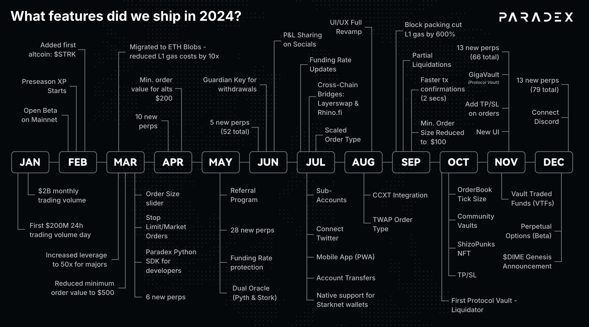

<Tabs>
  <Tab title="2025 & Beyond">
    ### Upcoming
    <CardGroup cols={4}>
      <Card title="Liquidity" icon="layer-group">
        - RFQ Trading w/ [Paradigm](https://app.paradigm.trade/))
        - Midpoint Dark Orders for Whales
      </Card>
      <Card title="Platform" icon="chart-network">
        - Redesign of the trading experience (Desktop 3.0 / Mobile 2.0)
        - Fast Isolated Margin Transfers
        - Fast Isolated Margin Account Value Updates
        - Spot
        - Spot VTFs
        - Portfolio Margin
        - Dated Options
        - Multiple Collateral Types
        - Auto-Borrow and Lend
        - XUSD (Delta-Neutral Synthetic Dollar)
        - Pre-market Perps
      </Card>
      <Card title="Infra" icon="lighthouse">
        - Upgrade to SN 0.14 (Decentralized Sequencer Architecture)
        - Reduce P95 order creation end to end latency < 50ms
        - Interop with Hyperlane
        - SuperChain Mainnet
      </Card>
      <Card title="Privacy" icon="signature-lock">
        - Full Position Privacy via RPC Masking (L2) + Encrypted DA (L1)
        - Full Smart Contract-Level Privacy with Cryptographic Guarantees
      </Card>
    </CardGroup>

    ### 2025 Q4
    <CardGroup cols={3}>
      <Card title="Oct 2025">
        **New Markets**
          - 12 new perpetual markets

        **Liquidity & Trading**
          - [TAP Affiliate Program](https://x.com/paradex/status/1975585238404505996)
          - [FastFills Taker Discount](https://discord.com/channels/1107916848193863740/1107926829739819022/1431636494610727083)

        **Performance & Infra**
          - [XP Transfers](https://x.com/paradex/status/1983042695120728386)
          - 200% blockchain throughput increase (Cairo Native)
          - Cancel all by market performance improvements

        **UX**
          - Drag TPSL to edit directly on charts
          - Faster candlestick rendering
          - Order book spread synced with order book updates
          - Faster estimated PnL updates
          - ISO tagging on transfers table
          - Persist order builder configurations between page reloads
          - Granular notification settings by type
          - Filters in Trade and Order History tabs
          - Order history on mobile trade tab
          - Trade Time display on mobile trade tape
      </Card>
    </CardGroup>

    ### 2025 Q3
    <CardGroup cols={3}>
      <Card title="Jul 2025">
        **New Markets**
          - 10 new perpetual markets
          - PAXG Perpetual Options Launch

        **Performance & Infra**
          - [Interchain Deposits powered by Hyperlane (Beta)](/getting-started/whats-new/2025/7/18#interchain-deposits-powered-by-hyperlane-beta)
          - Portfolio Margin (Invite Only Beta)
          - Retail Order Tagging for Takers
          - Blocktrade / Positions Transfer API (Invite Only Beta)
          - [Bridge using Orbiter Finance](/getting-started/whats-new/2025/7/18#orbiter-finance-bridge)

        **UX**
          - Show Total UP&L on Portfolio and Account Summary
          - Aggregate multiple fills on trade history
          - Estimated P&L in TP/SL order builder
          - Calculate Size in TPSL
          - Volume on Mark Price chart
          - Withdraw Vault Tokens in USDC Terms
          - Search markets using alias terms
          - RPI Savings on Orderbook
          - Weekly and monthly chart timeframes
          - Display account USDC balance on deposit modal for all chains
          - Resizable charts on trade page
          - Deposit max USDC on deposit modal
          - Display usernames in Switch Account modal
      </Card>
      <Card title="Aug 2025">
        **New Markets**
          - 5 new perpetual markets

        **Performance & Infra**
          - Interchain Withdrawals powered by Hyperlane (Beta)
          - [Public Bug Bounty](https://immunefi.com/bug-bounty/paradex/information/)

        **UX**
          - Populate Bid / Mid / Ask values in limit close modal
          - Date tooltip on trade tape trade time
          - Sort by column headers in open orders, trade history and order history
          - Set USD order size as a configurable default
          - Adjust margin button for isolated margin position on mobile
          - Numeric keyboard for number inputs on iOS
          - Orderbook decimals now match selected tick size
      </Card>
      <Card title="Sep 2025">
        **Markets**
          - 20 new perpetual markets

        **Liquidity & Trading**
          - ZERO Fee Perps

        **Performance & Infra**
          - Revamped referral code infrastructure

        **UX**
          - Toggle notification settings based on type
          - Step-by-step wallet connection progress indicator
          - Size no longer changes when switching between buy/sell
          - Disable chart market symbol labels by default
          - Market dropdown sorting persists between page changes
          - Lifetime fee savings on Portfolio page
          - Show Vaults 24h returns
          - Share XP card
      </Card>
    </CardGroup>

    ### 2025 Q2
    <CardGroup cols={3}>
      <Card title="Jun 2025">
        **New Markets**
          - 6 new perpetual markets

        **Liquidity & Trading**
          - [Retail Price Improvement (RPI) Orders](/trading/rpi)
  

        **Performance & Infra**
          - Deposit from Solana

        **UX**
          - Mobile UI 2.0
          - Dollar-denominated TP/SL orders
          - Switch accounts from Portfolio Page
          - Drawing Utils on Trading View
      </Card>

      <Card title="May 2025">
        **New Markets**
          - 4 new perpetual markets
          - HYPE Perpetual Options launch

        **Performance & Infra**
          - 50-70% order latency reduction across P50, P95, P99

        **Liquidity & Trading**
          - Enhanced Funding PnL logic
          - Revamped Funding PnL Realization logic
          - Estimated Margin on Order Builder

        **UX**
          - Extended portfolio charts (90d/180d)
          - RhinoFi and Layerswap bridge flows integrated within UI
      </Card>

      <Card title="April 2025">
        **New Markets**
          - 5 new perpetual markets
          - BTC/ETH/SOL Perpetual Options launch

        **Liquidity & Trading**
          - Isolated Margin for Perp futures
          - Advanced TP/SL functionality
          - Option Greeks on order builder

        **UX**
          - CSV exports on Portfolio Page
          - Configurable slippage
          - Switch between Spot and Mark price for Order Values displayed on UI
      </Card>
    </CardGroup>

    ### 2025 Q1
    <CardGroup cols={3}>
      <Card title="March 2025">
        **New Markets**
          - 6 new perpetual markets

        **Liquidity & Trading**
          - Modify open orders price and size
          - Redesigned order builder

        **Performance & Infra**
          - Opened Paradex Chain [to external developers on Testnet](https://x.com/tradeparadex/status/1897968442780926336)
      </Card>

      <Card title="February 2025">
        **New Markets**
          - 8 new perpetual markets

        **Liquidity & Trading**
          - Configurable Max Leverage

        **UX**
          - Filtering Markets by Categories and Favorites
          - Trade History on TradingView Chart
      </Card>

      <Card title="January 2025">
        **New Markets**
          - 11 new perpetual markets
          - Private Beta Release of Perpetual Options

        **Liquidity & Trading**
          - Multi-strategy Vaults (Gigavault only)
          - Limit TPSL Orders

        **Performance**
          - Latency Improvements (5x throughput)

        **UX**
          - Social Logins with Privy
      </Card>
    </CardGroup>
  </Tab>

  <Tab title="2024 Achievements">
    <Frame caption="Paradex 2024 Journey">
      
    </Frame>

    ### 2024 Q4
    <CardGroup cols={3}>
      <Card title="December 2024">
        * Added 13 new perps (79 markets total)
        * Graceful Switching Between Multiple Wallets
        * Native Mobile App (Upgrade from PWA)
        * Connect Discord to User Accounts
        * Announced [$DIME Genesis Event](https://x.com/ParadexFNDN/status/1869049912454738284)
      </Card>

      <Card title="November 2024">
        * Added 13 new perps (66 markets total)
        * Launched Gigavault LP - Our Liquidity Provider Vault with 50% APR
        * Allow users to add TPSL while submitting a Market or Limit Order
        * Introduced Vault Traded Funds (VTFs) managed by Verified Operators
      </Card>

      <Card title="October 2024">
        * Liquidator Vault (Insurance Fund) - Our First Protocol Vault!
        * Advanced Order Types - Take Profit/Stop Loss
        * Show off your ShizoPunks NFT as your Paradex profile pic ️
        * Added 4 new perps: \$BOME, \$POPCAT, \$PEOPLE, \$kFLOKI (50 markets total!)
        * Community Vaults has launched - anyone can now operate their own Vaults
        * Introduced ability to aggregate order book prices on different tick sizes
        * Leverage Slider now works for USD amounts
      </Card>
    </CardGroup>

    ### 2024 Q3
    <CardGroup cols={3}>
      <Card title="September 2024">
        * Historical Funding Rate Page
        * Launched Partial Liquidations - Stay in the game longer!
        * Added Estimated Liquidation Price to Order Builder
        * Reduced minimum order size to $100
        * Rolled out \$AAVE Perp
      </Card>

      <Card title="August 2024">
        * Launched \$TRON Perp, delisted \$MATIC
        * Slick new UI/UX
        * Added TWAP Advanced Order Type for better execution
        * Customized TradingView indicators/preferences
        * CCXT Integration
      </Card>

      <Card title="July 2024">
        * Funding Rate Updates: Clamping & external rates for stability
        * Integrated Cross-Chain Bridges: Layerswap & Rhinofi
        * Native support for ArgentHQ and Braavos wallets
        * Transfer USDC between Paradex accounts instantly
        * Launched Mobile App
        * Launched Sub-accounts
        * Twitter integration and advanced profile features
        * Added Scaled Order Type
      </Card>
    </CardGroup>

    ### 2024 Q2
    <CardGroup cols={3}>
      <Card title="June 2024">
        * Launched 5 new perps (52 total)
        * Rolled out Guardian Key for multi-signature withdrawal
        * Show off your trades with our P\&L sharing card
      </Card>

      <Card title="May 2024">
        * Added 28 new perps, delisted \$FET
        * Launched Referral Program
        * Launched OI + TVL Points Program
        * Introduced Funding Rate Protections
      </Card>

      <Card title="April 2024">
        * Added 10 new perps
        * Reduced minimum order value for altcoins to $200
      </Card>
    </CardGroup>

    ### 2024 Q1
    <CardGroup cols={3}>
      <Card title="March 2024">
        * Added 6 new perps
        * Increased leverage to 50x for majors
        * Reduced minimum order value to $500
        * Added Order Size Slider for easy adjustments
        * Introduced Stop Limit/Market Orders
        * Launched Paradex Python SDK for developers
        * Migrated to ETH Blobs for data availability—reduced L1 gas costs by 10x!
      </Card>

      <Card title="February 2024">
        * Open Beta on Mainnet!
        * Launched Paradex Points Program
        * Added first altcoin: \$STRK hits the platform
      </Card>

      <Card title="January 2024">
        * First **$200M** 24H trading volume day!
        * Surpassed **$2BM** monthly trading volume
      </Card>
    </CardGroup>
  </Tab>
</Tabs>
