## 🟩 **Example 1: Long Call (Bullish Bet)**

### ✅ Setup

- **BTC Spot Price**: $85,381.9
- **Strategy**: Alice is bullish and buys a Call Option — **BTC-USD-88000-C**
- **Strike Price**: $88,000
- **Ask Price**: $248.9
- **Mark Price**: $192.9

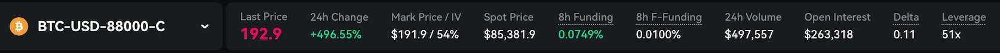
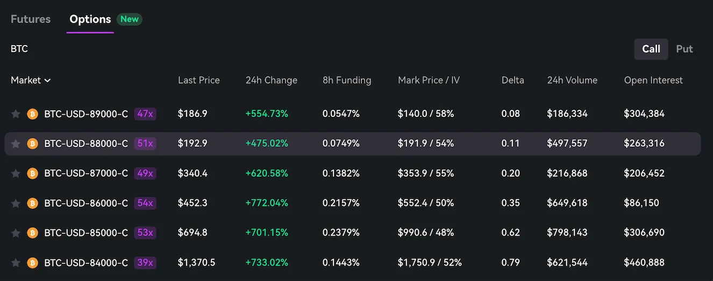

## 🧮 Order Entry

- Alice can choose to enter the order size in either BTC or USD Spot Notional (Size x Spot Price) terms.
- Alice enters a **\$2,000 USD Notional** → `0.023 BTC` or **(2,000 / 85,381)**
- She submits a **market buy** at $248.9

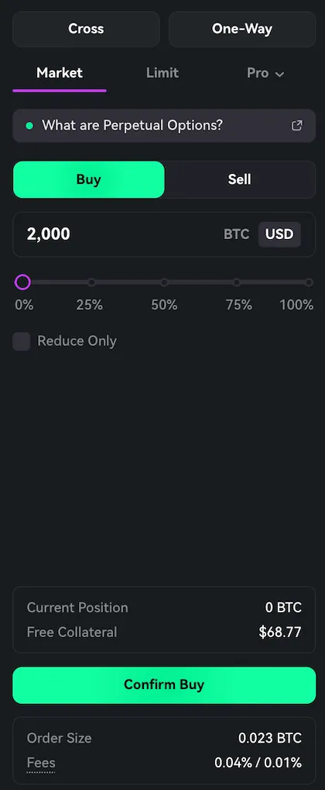

- **Position Opened**:
  - Size: **0.023 BTC**
  - Entry Price: **\$248.9**
  - Spot Notional = Size x Spot Price= `0.023 × 85,381` ≈ **\$1,963**
  - **8h Funding Rate**: 0.0749% → Expected funding cost per 8h = `0.023 × 0.000749 × 85,381` ≈ **\$1.47**
  - **Unrealized PnL at Entry** = `0.023 × (192.9 - 248.9)` ≈ **1.30 USD**
    - Alice has a slight Unrealized PnL at Entry because the Mark Price **(\$192.9)** is below the Entry Price **(\$248.9\)**

### After 12 Hours

- **Spot Price** rises from **\$85,381** to **\$87,000**
- **Mark Price** rises from **\$192.9** to **\$503**
- **Avg 8h Funding Rate (over 12 hours)**: 0.08%
- **Avg Spot Price (over 12 hours)**: \$86,000
- **Funding Cost** ≈ `0.023 × 0.0008 × 12 ÷ 8 × 86,000` ≈ **\$2.37**

### Final PnL

- Option PnL: `0.023 × (503 - 248.9)` ≈ **+5.84 USD**
- Less Funding: **2.37 USD**
- **Total Unrealized PnL**: **+3.47 USD**
- **PnL %**: `3.47 ÷ (0.023 × 248.9)` ≈ +61%

## 🟥 **Example 2: Long Put (Bearish Bet)**

### ✅ Setup

- **BTC Spot Price**: $85,381.9
- **Strategy**: Bob is bearish and buys a Put Option — **BTC-USD-83000-P**
- **Strike Price**: $83,000
- **Ask Price**: $233.2
- **Mark Price**: $199.8

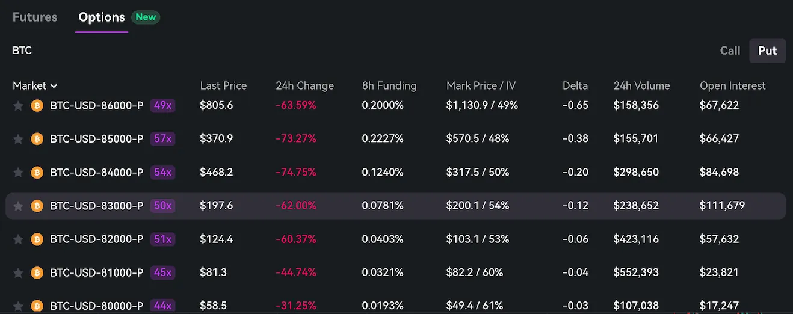

### 🧮 Order Entry

- Bob can choose to enter the order size in either BTC or USD Spot Notional (Size x Spot Price) terms.
- Bob enters a **\$1,000 USD Spot Notional** → `0.012 BTC`
- Submits a **market buy** at $233.2

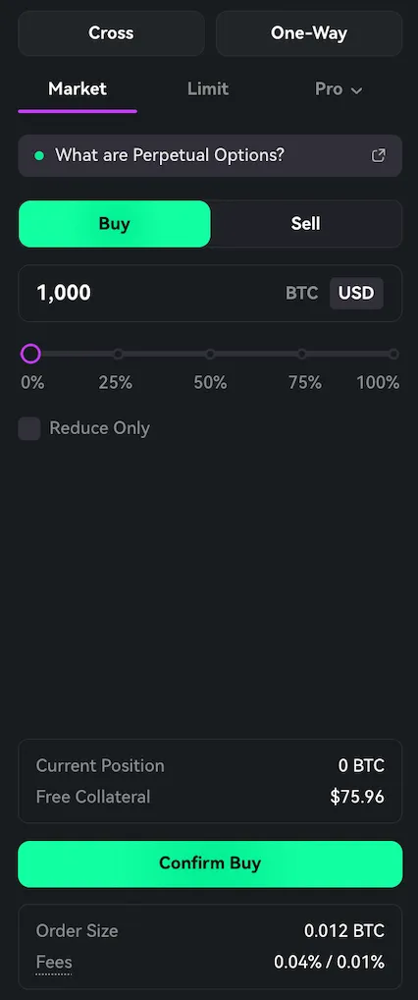

- **Position Opened**:
  - Size: **0.012 BTC**
  - Entry Price: **\$233.2**
  - Spot Notional = Size x Spot Price =`0.012 × 85,381` ≈ **\$1,024.57**
  - **8h Funding Rate**: 0.078% → Expected funding cost per 8h = `0.012 × 0.00078 × 85,381` ≈ **\$0.80**
  - **Unrealized PnL at Entry** = `0.012 × (200.1 - 233.2)` ≈ **\$0.39**
    - Bob has a slight Unrealized PnL at Entry because the Mark Price **(\$200.1)** is below the Entry Price **(\$233.2\)**

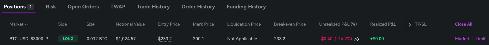

### After 12 Hours

- **Spot Price** drops from **\$85,381** to **\$83,500**
- **Mark Price** rises from **\$200.1** to **\$605**
- **Avg 8h Funding Rate (over 12 hours)**: 0.10%
- **Avg Spot Price (over 12 hours)**: \$85,000
- **Funding Cost** ≈ `0.012 × 0.0010 × 12 ÷ 8 × 85,000` ≈ **\$1.53**

### Final PnL

- Option PnL: `0.012 × (605 - 200.1)` ≈ **+3.32 USD**
- Less Funding: **1.53 USD**
- **Total Unrealized PnL**: **+3.32 USD**
- **PnL %**: `3.32 ÷ (0.012 × 233.2)` ≈ +118%

## 🟥 **Example 3: Short Call (Bearish Bet - Expecting Low Volatility)**

### ✅ Setup

- **BTC Spot Price**: $84,332.3
- **Strategy**: Charlie is bearish and expects low volatility. He sells a Call Option — **BTC-USD-84000-C**
- **Strike Price**: $84,000
- **Bid Price**: $1,112.5
- **Mark Price**: $1,140.6
- **8h Funding Rate:** 0.3195%
  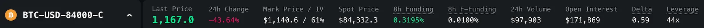
  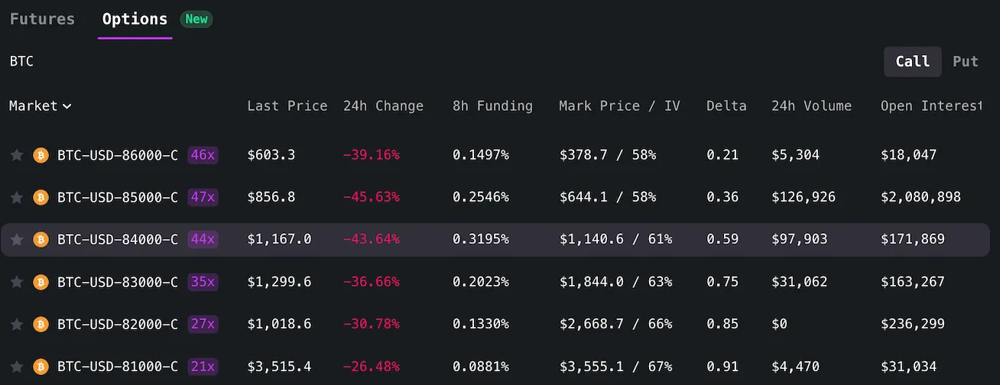

### 🧮 Order Entry

- Charlie can choose to enter the order size in either BTC or USD Spot Notional (Size x Spot Price) terms.
- Charlie enters a **\$1,500 USD Spot Notional** → `0.018 BTC`
- Submits a **market sell** at $1,112.5

  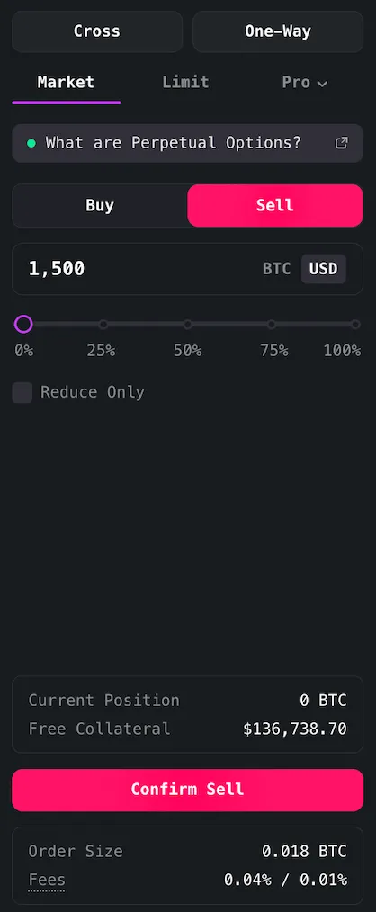

- **Position Opened**:
  - Size: **0.018 BTC**
  - Entry Price: **\$1,140.6**
  - Spot Notional = Size x Spot Price =`0.018 × 84,332.3` ≈ **\$1,518**
  - **8h Funding Rate**: 0.3195% → Expected funding cost per 8h = `0.018 × 0.003195 × 84,332.3` ≈ **\$0.80**
  - **Unrealized PnL at Entry** = `-0.018 × (1,140.7 - 1,112.5)` ≈ **0.50 USD**
    - Charlie has a slight Unrealized PnL at Entry because the Mark Price **(\$1,140.7)** is above the Entry Price **(\$1,112.5)**

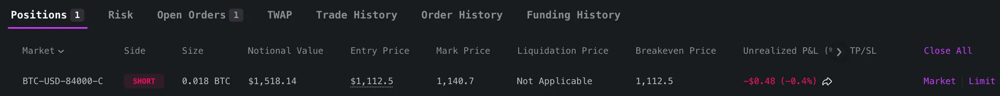

### After 12 Hours

- **Spot Price** drops from **\$84,332.3** to **\$84,000**
- **Mark Price** drops from **\$1,140.7** to **\$961**
- **Avg 8h Funding Rate (over 12 hours)**: 0.35%
- **Avg Spot Price** **(over 12 hours)**: 84,200
- **Funding Profit**: `0.018 × 0.0010 × 12 ÷ 8 × 84,200` ≈ **2.27 USD**

### Final PnL

- Option PnL: `-0.018 × (961 - 1,140.7)` ≈ **+3.23 USD**
- Plus Funding: **2.27 USD**
- **Total Unrealized PnL**: **+5.51 USD**
- **PnL %**: `5.51 ÷ (0.018 × 1,112.5)` ≈ +28%

## 🟩 **Example 4: Short Put (Bullish Bet - Expecting Low Volatility)**

### ✅ Setup

- **BTC Spot Price**: $84,410.1
- **Strategy**: Dave is bullish but expects low volatility. He sells a Put Option — **BTC-USD-84000-P**
- **Strike Price**: $84,000
- **Bid Price**: $701.0
- **Mark Price**: $709.2
- **8h Funding Rate:** 0.2801%

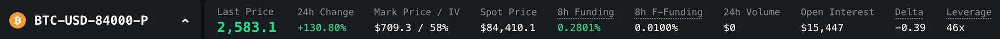
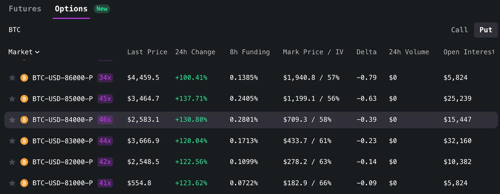

### 🧮 Order Entry

- Dave can choose to enter the order size in either BTC or USD Spot Notional (Size x Spot Price) terms.
- Dave enters a **\$2,000 USD Spot Notional** → `0.024 BTC`
- Submits a **market sell** at $723.0

  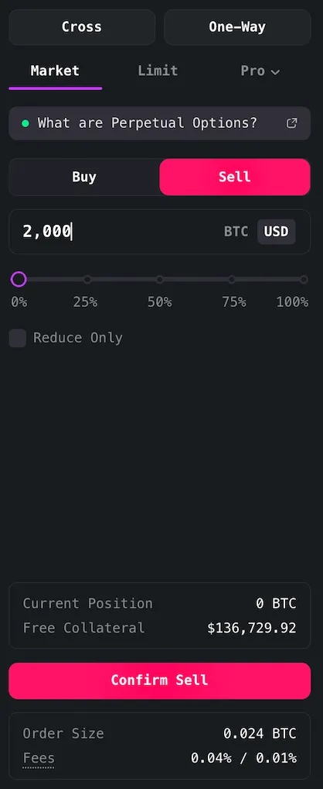

- **Position Opened**:
  - Size: **0.024 BTC**
  - Entry Price: **\$723.0**
  - Spot Notional = Size x Spot Price =`0.024 × 84,410.1` ≈ **\$2,024**
  - **8h Funding Rate**: 0.2801% → Expected funding cost per 8h = `0.024 × 0.002801 × 84,410.1` ≈ **\$5.67**
  - **Unrealized PnL at Entry** = `-0.024 × (730.4 - 723.0)` ≈ **0.17 USD**
    - Dave has a slight Unrealized PnL at Entry because the Mark Price **(\$730.4)** is above the Entry Price **(\$723.0)**

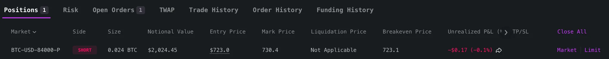

### After 12 Hours

- **Spot Price** rises from **\$84,410.1** to **\$84,500**
- **Mark Price** drops from **\$730.4** to **\$675**
- **Avg 8h Funding Rate (over 12 hours)**: 0.27%
- **Avg Spot Price** **(over 12 hours)**: 84,450
- **Funding Profit**: `0.024 × 0.0027 × 12 ÷ 8 × 84,450` ≈ **8.20 USD**

### Final PnL

- Option PnL: `-0.024 × (675 - 730.4)` ≈ **+1.32 USD**
- Plus Funding: **2.27 USD**
- **Total Unrealized PnL**: **+9.53 USD**
- **PnL %**: `9.53 ÷ (0.024 × 723.0)` ≈ +55%
