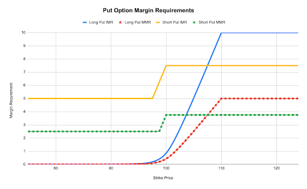

Margin requirements are the amount of collateral you need to maintain in your account to open and hold positions. They help ensure you can meet your obligations and protect against potential losses.

# Cross Margin

Cross Margin allows you to use your entire account balance as collateral for all your positions. This means your profits from one position can offset losses from another, potentially reducing your overall margin requirements.

<Note>Paradex will soon offer **Portfolio Margin** which will significantly improve margin requirements for hedged portfolios, particularly for users that are short Perpetual Options.</Note>

## Key Terms

- **Initial Margin (IMR)**: The minimum amount required to open a position
- **Maintenance Margin (MMR)**: The minimum amount required to keep a position open
- **In-the-Money (ITM)**: Options where the strike price is favorable compared to the current market price
- **Out-of-the-Money (OTM)**: Options where the strike price is unfavorable compared to the current market price
- **Premium**: The price of an option contract

<Tip title="Core Idea" icon="leaf">
Cross Margin Requirements for Perpetual Options depend on their type (call/put), moneyness (out-of-money vs in-the money) and the mark price of the Option. Margin requirements vary by underlying asset.
</Tip>

## Parameters

The parameter values below are examples. The parameters are configurable by the underlying asset.

| **Fraction Parameter** | **Initial Margin (IMR)** | **Maintenance Margin (MMR)** |
|------------------------|--------------------------|------------------------------|
| Premium Multiplier     | 100%                     | 50%                          |
| Long ITM Fraction      | 10%                      | 5%                           |
| Short ITM Fraction     | 7.5%                     | 3.75%                        |
| Short OTM Fraction     | 5%                       | 2.5%                         |
| Short Put Cap          | 50%                      | 50%                          |

# Margin Calculation

## Buying Options

Required Margin = min(Premium Multiplier × Option Mark Price, long_itm × Spot Price)

<Tip title="Example">
Let's say you want to buy a call option:
- Premium Multiplier: 100%
- Option Mark Price: $100
- Long ITM Fraction: 10%
- Spot Price: $10,000

Required Margin = min(100% × \$100, 10% × \$10,000) 
= min(\$100, \$1,000) 
= $100
</Tip>

## Selling Options

Base Margin = max(short_itm × Spot Price - OTM Amount, short_otm × Spot Price)

where OTM Amount is:
- For calls: max(0, Strike Price - Spot Price)
- For puts: max(0, Spot Price - Strike Price)

**For call options**  
Required Margin = Base Margin

**For put options**  
Required Margin = min(Base Margin, short_put_cap × Strike Price)

<Tip title="Example">
Let's say you want to sell a put option:
- Spot Price: $10,000
- Strike Price: $9,000
- Short ITM Fraction: 7.5%
- Short OTM Fraction: 5%
- Short Put Cap: 50%

OTM Amount = max(0, \$10,000 - \$9,000) = \$1,000

Base Margin = max(7.5% × \$10,000 - \$1,000, 5% × \$10,000) 
= max(\$750 - \$1,000, \$500) 
= max(-\$250, \$500) 
= \$500

Required Margin = min(\$500, 50% × \$9,000) 
= min(\$500, \$4,500) 
= \$500
</Tip>

# Visual Examples

The margin plots below show the margin requirements for both call and put options across various strikes ranging from deep out the money (OTM) to in the money (ITM).

<Tabs>
  <Tab title="Call Options">
    <Frame background="subtle">
      
    </Frame>
  </Tab>
  <Tab title="Put Options">
    <Frame>
      
    </Frame>
  </Tab>
</Tabs>
