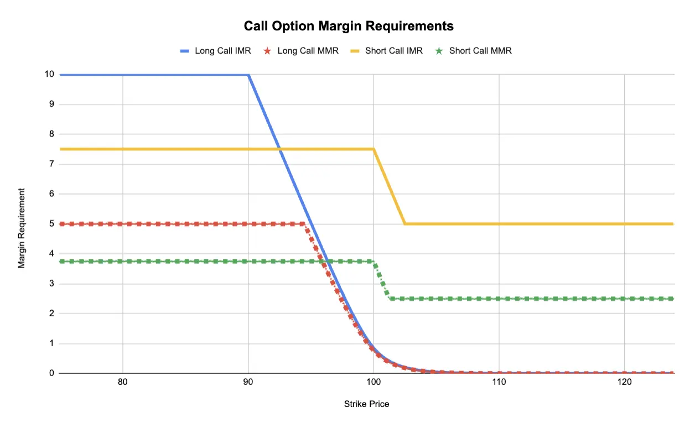
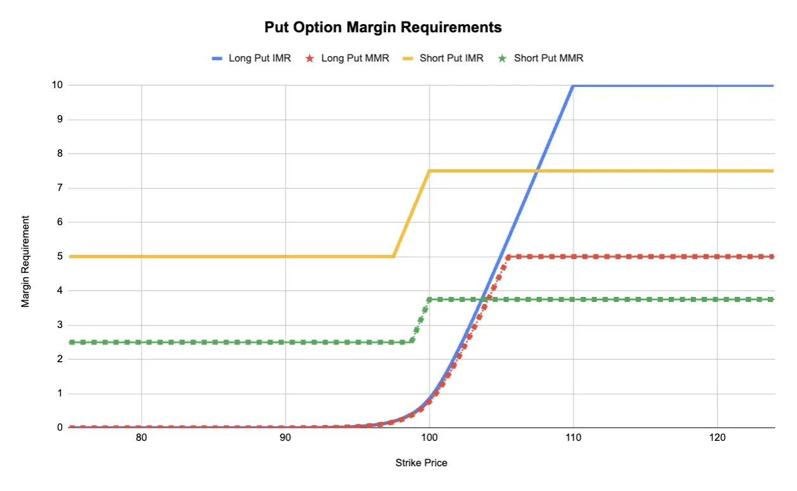

Paradex currently supports Cross Margin for Perpetual Options. This means that users can trade options together with Perpetual Futures and benefit from PnL offsetting across all futures and options markets.

Cross Margin Requirements for options depends on their type (call/put), moneyness (out-of-money vs in-the money) and the mark price.

Paradex will soon enable Portfolio Margin (coming Jan 2025) which will unlock much higher capital efficiency for hedged accounts. Portfolios with low risk will benefit from much lower margin requirements under Portfolio Margin Mode

## Cross Margin Requirements

Options margin requirements in cross margin mode depend on :

- **Side (Buy/Sell)**
- **OTM Amount** : Distance from Spot Price for Out-Of-Money options
- **Spot Price**
- **Option (Mark) Price**

Example of Option Cross Margin Parameters :

| **Fraction Parameter**                               | **Initial Margin (IMR)**            | **Maintenance Margin (MMR)**       |
| ---------------------------------------------------- | ----------------------------------- | ---------------------------------- |
| **Premium Multiplier**                               | `premium_multiplier_imf` **= 100%** | `premium_multiplier_mmf` **= 50%** |
| **Long ITM Fraction**                                | `long_itm_imf` **= 20%**            | `long_itm_mmf` **= 10%**           |
| **Short ITM Fraction**                               | `short_itm_imf` **= 15%**           | `short_itm_mmf` **= 7.5%**         |
| **Short OTM Fraction**                               | `short_otm_imf` **= 10%**           | `short_otm_mmf` **= 5%**           |
| **Short Put Cap** _(Max percentage of Strike Price)_ | `short_put_cap_imf` **= 50%**       | `short_put_cap_mmf` **= 50%**      |

_Note :_ The parameter values above are examples. The parameters will be configurable by underlying asset.

**Margin Requirement :**

**Buy :** $\min(\text{Premium Multiplier}*\text{Option Mark Price},~\text{long\_itm}*\text{Spot Price})$

_Example :_ Spot Price = 100 and User is long 1 option :

If Option Mark Price = 10 → IMR = Option Mark Price = 10 and MMR = 5

If Option Mark Price = 30 → IMR = 20% x Spot Price = 20 and MMR = 10% x Spot Price = 10

**Sell :** $\max(\text{short\_itm}~*~\text{Spot Price}-\text{OTM~Amount},~\text{short\_otm}~*~\text{Spot Price})$

where :

$$
\begin{equation*}
  \text{OTM~Amount} =
    \begin{cases}
      \max(0,~\text{Strike Price}-\text{Spot Price}) & \text{for a call option}\\
      \max(0,~\text{Spot Price}-\text{Strike Price}) & \text{for a put option}
    \end{cases}
\end{equation*}
$$

_Example :_ Spot Price = 100 and User is short 1 option :

- OTM Call Option with Strike Price = 106
  - OTM Amount = 5
  - IMR = max(15-6, 10) = 10
  - MMR = max(7.5-6, 5) = 5
- ITM Put Option with Strike Price = 106
  - OTM Amount = 0
  - IMR = max(15, 10) = 15
  - MMR = max(7.5, 5) = 7.5

Note that margin requirements for a short put option are capped by : $\text{short\_put\_cap}*\text{Strike Price}$. This is a protection for put margin requirement from being excessively high compared to the strike price which is the maximum theoretical price of the put option.

_Example :_ Spot Price = 100 and User is short 1 put option :

- OTM Put Option with Strike = 40 and Option Mark Price = 25
  - IMR = min(short_otm_imf * Spot Price, short_put_cap_imf * Strike Price) = min(10, 20) = 10
  - MMR = min(short_otm_mmf * Spot Price, short_put_cap_mmf * Strike Price) = min(5, 20) = 5

The plots below show the call and put margin requirement charts across different strikes :

<Frame caption="Call Option Margin Requirement">
  
</Frame>
<Frame caption="Put Option Margin Requirement">
  
</Frame>
