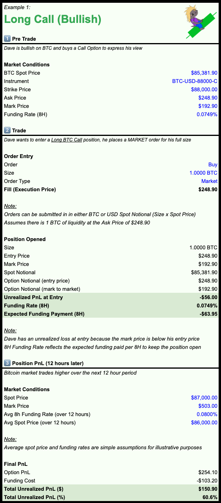
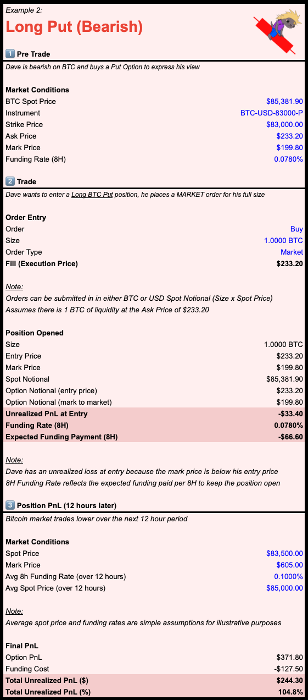
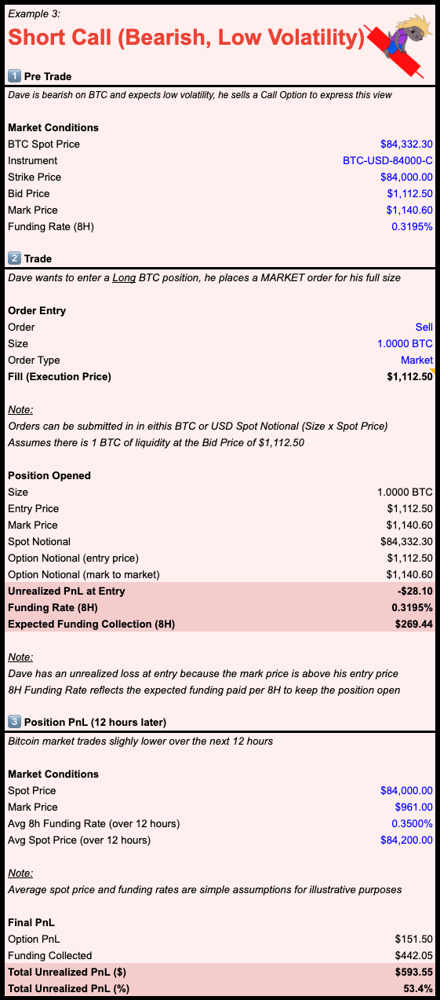
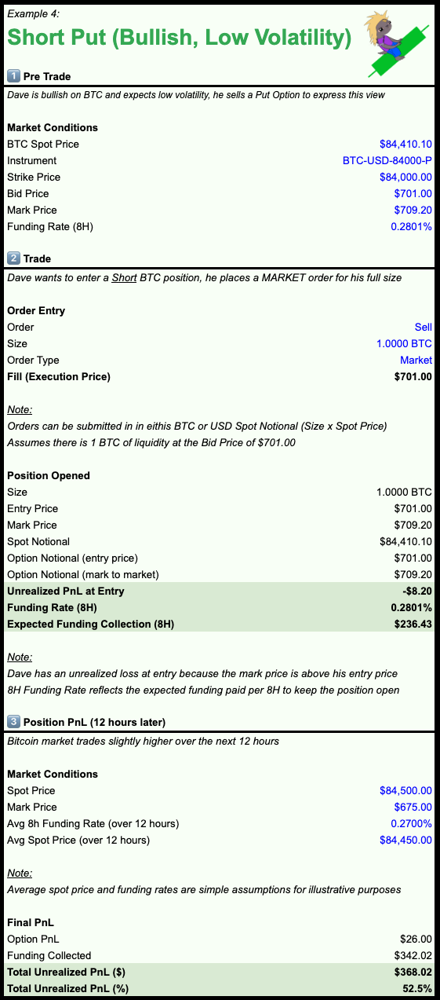

<Tabs>
  <Tab title="Long Call">
     <Frame caption="Long Call Example Trade" background="subtle">
       
     </Frame>    
  </Tab>

  <Tab title="Long Put">
     <Frame caption="Long Put Example Trade" background="subtle">
       
     </Frame> 
  </Tab>
  
  <Tab title="Short Call">
      <Frame caption="Short Call Example Trade" background="subtle">
       
     </Frame> 
  </Tab>

  <Tab title="Short Put">
      <Frame caption="Short Put Example Trade" background="subtle">
       
     </Frame> 
  </Tab>

</Tabs>

[Perp Options Trade Examples](https://docs.google.com/spreadsheets/d/1FMM-41AALODzlaWHMzIoLBhAKN8PlITNY6BnNOzu2tk/copy)
