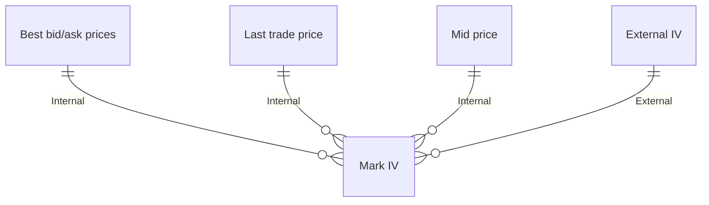

# Perpetual Options Explained

Perpetual Options combine features of traditional options with a funding mechanism that allows them to exist without expiration dates.

# Core Concepts

## Option Valuation

The mark price of a Perpetual Option depends on 6 major inputs:

<CardGroup cols={3}>
  <Card title="Option Type" icon="fa-solid fa-toggle-on">
    
Call or Put option

  </Card>
  <Card title="Spot Oracle Price" icon="fa-solid fa-chart-line">
    
Current price of the underlying asset

  </Card>
  <Card title="Strike Price" icon="fa-solid fa-bullseye">
    
Predetermined price at which the option can be exercised

  </Card>
  <Card title="Mark Implied Volatility (Mark IV)" icon="fa-solid fa-chart-bar">
    
Estimated volatility used in price calculations

  </Card>
  <Card title="Interest Rate" icon="fa-solid fa-percent">
    
Derived from Paradex Futures Funding Rate

  </Card>
  <Card title="Funding Period" icon="fa-solid fa-clock">
    
Set at 24 hours for continuous funding

  </Card>
</CardGroup>

Paradex calculates prices using the Black-Scholes formula adapted for perpetual options with continuous funding.

### Implied Volatiility (IV)

Paradex maintains a Mark Implied Volatility that reflects a fair estimate of market IV even when the perpetual option may be illiquid. Mark IV is derived from 4 inputs:

## Time Value

In Perpetual Options, Time Value is the difference between the mark price of the option and its intrinsic value:

$$\text{Time Value} = \text{Mark Price} - \text{Intrinsic Value}$$

<Tip title="Core Idea" icon="leaf">
Time Value represents the premium or value traders are willing to pay for the option's potential future value.
</Tip>

## Funding Mechanism

The funding mechanism is how Perpetual Options maintain their perpetual nature. Long positions continuously pay short positions a funding rate based on the option's time value.

- **Funding Period:** 5 days (funding is paid continuously)
- **Funding Premium:** The total amount of funding paid over the funding period, equal to the time value of the option:
  
  Funding Premium = Time Value = Mark Price - Intrinsic Value

<Tip title="Core Idea" icon="leaf">
The Funding Period is a critical concept to understand. It represents the expected period of time over which a user will pay the time value of the option via Funding. This is a parameter chosen by Paradex and is what makes the current Perpetual Option similar (but not equal to) a 5-day dated option.
</Tip>

### Example

For a BTC-USD-104000-C with:
- Spot Price: $100,000
- Mark Price: $500
- Intrinsic Value: $0 (out-of-the-money)
- Time Value: $500

If Dave buys 5 contracts and holds for 8 hours with unchanged prices:
- Funding PnL = -5 × ($500 / 5) * 8/24 = -$166.67

Funding accrues continuously as unrealized PnL and is realized whenever the position is updated.

## Option Types

<Tabs>
  <Tab title="Perpetual Call Options">
    Similar to a traditional dated call option, a Perpetual Call Option gives the holder the right to benefit from price increases above the strike price. The intrinsic value of a Call option is:
    
    $\text{max}(\text{Spot Price} - \text{Strike Price}, 0)$
    
    - When Spot Price > Strike Price: The option is "in-the-money" (ITM)
    - When Spot Price < Strike Price: The option is "out-of-the-money" (OTM)
  </Tab>
  <Tab title="Perpetual Put Options">
    Similar to a traditional dated put option, a Perpetual Put Option gives the holder the right to benefit from price decreases below the strike price. The intrinsic value of a Put option is:
    
    $\text{max}(\text{Strike Price} - \text{Spot Price}, 0)$
    
    - When Spot Price < Strike Price: The option is "in-the-money" (ITM)
    - When Spot Price > Strike Price: The option is "out-of-the-money" (OTM)
  </Tab>
</Tabs>
