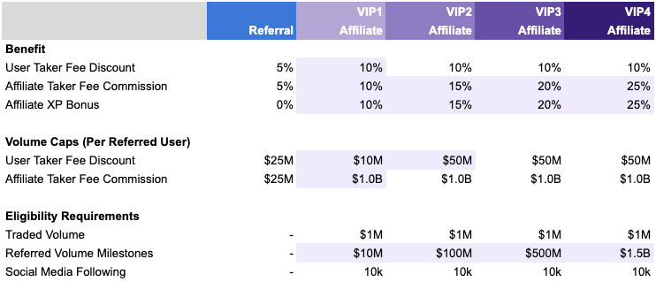

## Season 2 Affiliate Program

Community members with significant reach may qualify for our Affiliate Program, which offers enhanced rewards for contributing to the growth of the Paradex ecosystem.

### Affiliate Benefits

* Earn up to **25% XP bonus** on your referred users' XP earnings
* Earn up to **25% commission** on your referred users' taker fees
* Earn [**ShizoPunk NFTs**](https://opensea.io/collection/shizopunks) (while supplies last)
* Apply today through our [Affiliate Application](https://forms.gle/T4UKjinSefnVgiJx8)

<Note>XP bonuses are retroactive for Season 2 - as you unlock higher Affiliate Status, your new XP bonus rate will apply to all Season 2 XP earnings from your referrals. Commission rate increases are on forward looking basis only</Note>

<Warning>Affiliates must have a **10K social media following** (real followers) before they are eligible to apply</Warning>

<Frame>

</Frame>

* Eligibility criteria are subject to Paradex discretion. 
** Affiliate XP is incremental to the base weekly XP distributed to Paradex users. 

## NEW: Sub-Affiliate Program

Our newly launched Sub-Affiliate Program enables participants to earn XP by introducing new Affiliates to Paradex:
* Earn a **10% bonus on all "Affiliate XP" earnings** generated by Affiliates you directly refer (one level only)
* **No cap** on how much you can earn through the Sub-Affiliate Program
* Sub-Affiliates must meet the same eligibility criteria as regular Affiliates
* You can apply to introduce an Affiliate to us via our [Affiliate Application](https://forms.gle/T4UKjinSefnVgiJx8)

<Frame>

</Frame>

<Note>If you refer an Affiliate that earns 10,000 Affiliate XP from their referred users, you would earn 1,000 XP (10%) as a Sub-Affiliate bonus</Note>

## Tracking your Affiliate Stats and Status

We are making upgrades to our UI to show more detailed Affiliate stats. In the short term you can check the [Paradex Affiliate Leaderboard](https://www.paradex.trade/stats) on our public stats dashboard to see how you rank and what Affiliate Status you have earned to date.

## Sybil Detection, Self-Referral & Eligibility

* Paradex uses an innovative sybil detection system that evaluates:
    * Platform identity (Twitter, Discord, Kaito social score), and 
    * Platform activity
* Both you and your referred users must comply with our [Terms of Service](https://www.paradex.trade/terms-of-service)

<Warning>XP and referral rewards for suspected sybil accounts or self referral activity will be slashed or reduced and your Affiliate Status will be revoked immediately</Warning>
