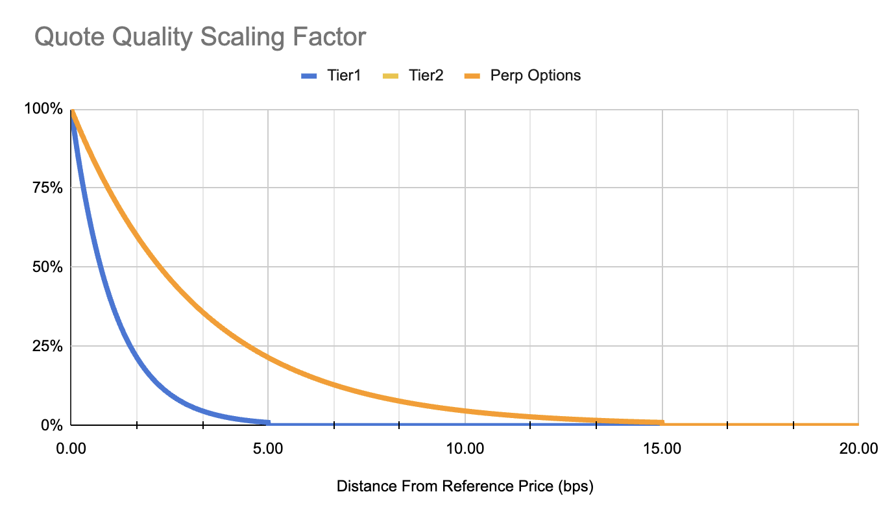

## XP Distribution (225,000 / week)

For the purposes of weekly XP distribution, we sum quote quality by user by market over the week and divide by total number of samples (~ every 1 minute). This gives us a single average quote quality metric we use for determining a users share of total exchange quote quality.

*Note: Quote Quality XP is as subset of the base 4,000,000 weekly XP distribution.*

### XP Distribution

- **75,000 (33%) - Tier 1 Perps**
- **150,000 (67%) - Tier 2 Perps**

<Tip>Distribution subject to change and will be announced weekly along with XP</Tip>

### The Process

1. **Sample Collection:** Quote Quality samples collected throughout the week
2. **Weekly Average:** Sum all samples ÷ number of samples = your average Quote Quality
3. **Market Share:** Your average ÷ total of all users' averages = your share %
4. **XP Distribution:** Your share % × weekly XP pool = your XP earned

### Key Points

- **Consistency matters**: Need to provide liquidity throughout the week, not just peak times
- **Quality beats quantity**: Tight spreads earn more than large but wide orders
- **Tier separation**: Each instrument tier has its own XP pool
- **Relative competition**: Your rewards depend on your performance vs. other LPs

<Tip>
Bottom line: Weekly XP = Your sustained liquidity quality as a % of total market quality.
</Tip>

## Key Concepts

| Term | Definition |
| --- | --- |
| Quote Quality | USD value that tracks the overall quality of an LP's liquidity provision over time using an exponential moving average of sample measurements |
| Sample Quote Quality | A snapshot measurement taken every few seconds that evaluates current order quality |
| Order Depth | How far an order's price is from the reference price (max(TOB, mid) for bids, min(TOB, mid) for asks), measured in basis points (bps). |
| Scaling factor | A penalty system that reduces the value of orders placed farther from the reference price |

## Quote Quality Calculation

<Steps>
  <Step title="Measure Order Distance from Market">
    For each order, we calculate how far its price is from the current reference price:

    $$
    \text{Bid Order Depth}=\frac{(\max(\text{TOB}, \text{mid}) - \text{Bid Order Price})}{\max(\text{TOB}, \text{mid})}*10,000
    $$

    $$
    \text{Ask Order Depth}=\frac{(\text{Ask Order Price} - \min(\text{TOB}, \text{mid}))}{\min(\text{TOB}, \text{mid})}*10,000
    $$

    Where:

    - **TOB** = Top-of-book price (best bid for bids, best ask for asks)
    - **mid** = Mid-market price (average of best bid and best ask)
  </Step>
  <Step title="Apply Distance Penalty">
    Orders farther from the reference price receive exponentially less weight. Each order's adjusted value is calculated as:

    $$
    \text{Adjusted Order Size}=\text{Order Size}~*~\exp\big(-\text{Scaling Factor}~*~\text{Order Depth}\big)
    $$

    The scaling factors are instrument-specific and designed so orders at maximum spread receive only 1% weight. Orders beyond the Max Spread are completely excluded from calculations.

    | **Term** | **Tier 1 Perps** | **Tier 2 Perps** | **Perp Options** |
    | --- | --- | --- | --- |
    | Instruments | BTC, ETH, SOL Perps | All other Perps | All Perp Options |
    | Max Spread  (Distance from Reference) | 5 bps | 15 bps | 15 bps |
    | Weight at Max Spread | 1.00% | 1.00% | 1.00% |
    | Scaling Factor | ~0.92 | ~0.31 | ~0.31 |

    <Frame caption="Quote scaling functions are set by instrument and tier = Tier 1 Perps, Tier 2 Perps, Perp Options.">
      
    </Frame>

    $$
    \text{Scaling Factor} = -\frac{\ln(\text{Weight at Max Spread})}{\text{Max Spread}}
    $$
  </Step>
  <Step title="Sum Adjusted Orders by Side">
    We then sum all adjusted orders by side:

    $$
    \begin{cases}
    \text{Sample Bid Quality} = \sum_{\text{Buy orders } b_i} \text{Adj. Bid Order Size}(b_i) \\
    \text{Sample Ask Quality} = \sum_{\text{Sell orders } s_i} \text{Adj. Ask Order Size}(s_i)
    \end{cases}
    $$
  </Step>
  <Step title="Calculate Sample Quote Quality">
    The system heavily rewards two-sided market making by putting a 70% weight on the minimum of bid and ask sample quality:

    $$
    \begin{equation*}
    \begin{cases}
    \text{Sample Quote Quality} = \\
    70\% \times \min(\text{Sample Bid Quality}, \text{Sample Ask Quality})  +  \\
    30\% \times \max(\text{Sample Bid Quality}, \text{Sample Ask Quality})
    \end{cases}
    \end{equation*}
    $$

    **Why 70% weight on minimum?**  
    This incentivizes providing liquidity on both sides rather than just one side of the market.
  </Step>
  <Step title="Calculate Moving Average">
    The final Quote Quality smooths out short-term fluctuations using a 20% weight on new measurements:

    $\text{Quote Quality}(t_{i+1})=20\%*\text{Sample Quote Quality}(t_{i+1})+80\%*\text{Quote Quality}(t_{i})$

  </Step>
</Steps>
