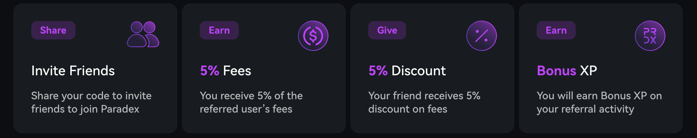
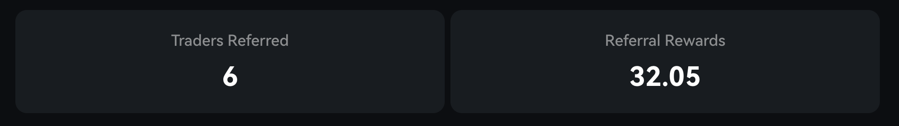

## Overview

<Frame>

</Frame>

Paradex has officially launched its referral program! Key benefits include:

* You receive **5%** of referred user's fees paid
* You receive a points bonus of **5%** of referred user's points earned
* Your referrals get a **5%** discount on their fees
* You receive bonus XP points for your referrals activity

## Dashboard
<Frame>

</Frame>

Dashboard will help you to keep track of:

* Number of <b>Traders Referred</b> who signed up from your referral link
* Amount of <b>Referral Rewards</b> you earned from trading activity of your referrals

<Info>
Referral Rewards shows the total earnings you’ve accumulated from referrals over time. 
Each time a referral completes a trade, the corresponding reward will be automatically added to your account balance.
</Info>

Head over the [referrals](https://app.paradex.trade/referrals) sections of the Paradex app to generate your referral code today!

<Warning>
Self referrals are not allowed. Users that are suspected of self-referral activity will lose their referral benefits
</Warning>

## Affiliate Program

You are eligible for the Affiliate Program if you have:

* Referred >$0 in lifetime volume
* 10,000+ social media followers

You can apply for the affiliate program [here](https://forms.gle/T4UKjinSefnVgiJx8).

### Eligibility

* You and your referee must not be a Restricted Persons as defined in the [Terms of Service](https://www.paradex.trade/terms-of-service)
