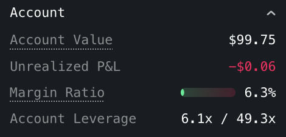

In Cross Margin, the account margin requirement is the total sum of margin requirements across markets :

$$
\text{Account Margin Requirement}~=~\sum\limits_{\text{market}~m}\text{Margin Requirement}(m)
$$

where $\text{Margin Requirement}$ can refer to **Initial Margin Requirement (IMR)** or **Maintenance Margin Requirement (MMR)**

# Initial Margin Requirement (IMR)

## Open Size

Open size represents the maximum position size the account can have if all orders on one side or the other are filled :

- $\text{Buy open size} = \max(0,~\text{Total size of buy orders} + \text{Signed position size})$
- $\text{Sell open size} = \max(0,~\text{Total size of sell orders} - \text{Signed position size})$

where the position sign is positive for a long position and negative for a short position

## IMR Breakdown

$\text{IMR}(m)$ is the account IMR for market $m$ and is composed of :

- $\text{Net IMR}$: This is a fraction of the Open Size value in USD. The fraction is called IMF (Initial Margin Fraction) and is equal to 1 / Leverage. The leverage is set by default to the market maximum leverage but can be updated to a lower level by the user.
- $\text{Fee Provision}$: This is a provision for the amount of entry/exit fees that the account is expected to pay based on open position/orders.
- $\text{Open Loss}$: This is a provision for orders that are aggressive relative to the mark price and are expected to lead to immediate unrealized loss after they are filled

$$
\text{IMR}(m)=\text{Net IMR}(m)+\text{Fee Provision}(m)+\text{Open Loss}(m)
$$

## Net IMR

For perpetual futures, the IMR for each side (buy/sell) is calculated as :

- $\text{Buy Initial Margin Requirement (IMR)} = \text{Buy open size * IMF}*\text{Mark Price}$
- $\text{Sell Initial Margin Requirement (IMR)} = \text{Sell open size * IMF}*\text{Mark Price}$

The Market Net IMR is equal to:

$$
\text{Market Net IMR}=\max(\text{Buy IMR},~\text{Sell IMR})
$$

### Example

User has :

- Short 1 BTC-USD-PERP (the signed position size is -1 BTC)
- 3 Buy BTC-USD-PERP open orders
- 2 Sell BTC-USD-PERP open orders

Assuming :

- BTC-USD-PERP IMF = 2%
- BTC-USD-PERP Mark Price is 90,000 USD

Buy open size = 3 - 1 = 2 BTC

Sell open size = 2 + 1 = 3 BTC

This user’s IMR for BTC-USD-PERP is :

Net IMR = Sell IMR = 2% * 3 * 90,000 = 5,400 USD

# Maintenance Margin Requirement (MMR)

The Maintenance Margin Requirement (MMR) only depends on open positions (not impacted by open orders) and is composed of :

- $\text{Net MMR}$: This is a fraction of the $\text{Net IMR}$ based on $\text{MMF Factor}$
    <Note>$\text{MMF Factor}$ is currently set to $50\%$ for all perpetual futures. This means that Net MMR is half of the Net IMR</Note>
- $\text{Fee Provision}$: This is a provision for the position exit fee, so this is equal to $\text{Taker Fee * Position Value}$

# Leverage

<Frame>
	
</Frame>

Account Leverage in UI shows two numbers :

- **Account Effective Leverage**

$$
\text{Account Effective Leverage}=\frac{\text{Open Notional}}{\text{Account Value}}
$$

where $\text{Open Notional}$ is the total Open Size expressed in USD and summed across markets

i.e.  $\text{Open Notional}=\sum\limits_{\text{market}~m}\text{Open Size}(m)*\text{Mark Price}(m)$

- **Account Maximum Leverage**

$$
\text{Account Maximum Leverage}=\frac{\text{Open Notional}}{\text{Account 
IMR}}
$$

This maximum leverage depends on the account maximum leverage per market. It represents the maximum allowed Effective Leverage beyond which the account will be unable to submit new orders that increase open notional.

