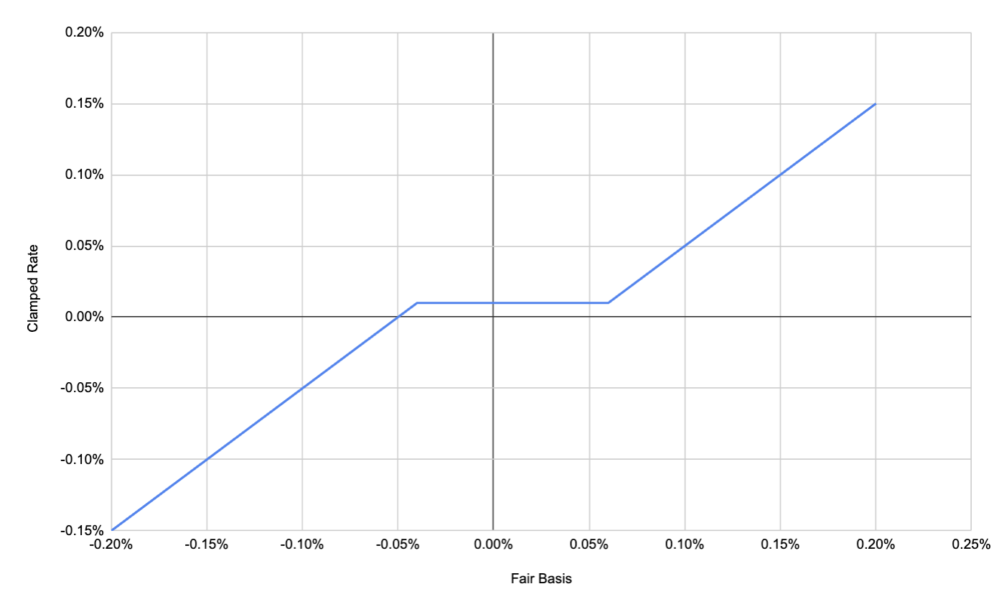

## Mechanism

Paradex perpetuals use **continuous funding**. The funding rate is recomputed every second and the funding index advances continuously. There are no fixed hourly or 8-hour funding events. Open positions accrue funding in real time, and the accrued funding PnL settles against your balance whenever the position is modified (trade, liquidation, transfer, or withdrawal).

The accrued funding contributes to the total unrealized PnL (and therefore to the account value), and is calculated in USDC, the settlement asset. The continuous accrual model reduces on-chain transaction spikes compared to discrete funding events.

### Pipeline overview

Each second:

1. **Fair Basis**: how far the perp is trading from spot.
2. **Raw Funding Rate**: Fair Basis pulled toward the Baseline Rate, clamped, and capped.
3. **Smoothed Funding Rate**: EWMA over the raw rate.
4. **Funding Premium**: the rate expressed in USDC per unit of notional.
5. **Funding Index**: advances by Premium × elapsed time.
6. **Accrued PnL**: applied to your position.

A worked numerical example for one tick is given in the [Example](#example) section below.

### Inputs

| Input | Description |
|-------|-------------|
| Spot Price | Paradex spot reference for the underlying. Drives Fair Basis and the Funding Premium. |
| USDC Price | Oracle price of USDC. Used to keep the Premium correct if USDC depegs. |
| External Venue Prices | Mark prices from Binance, Bybit, OKX, Hyperliquid, and Lighter, each compared against spot to produce a per-venue basis. |
| On-venue Quotes | Paradex best bid, best ask, last trade, and bid/ask mid. |
| Baseline Rate (Interest Rate) | Per-market constant the rate converges toward when the perp trades at fair value. Default 0.01% per 8h. |
| Clamp Rate | Per-market constant. Maximum pull of the Baseline toward or away from Fair Basis. Default 0.05% per 8h. |
| Max Funding Rate | Per-market cap on the raw rate. Default 5% per 8h. |
| Funding Period | Per-market reference window the rates above are quoted in. Default 8h. |

## Fair Basis

Fair Basis measures how rich or cheap the perp is versus spot. It is built from three sources, each treated as one vote:

- **On-venue quotes**: Paradex best bid, best ask, and last trade, each expressed as a basis $(\text{price} - \text{spot}) / \text{spot}$.
- **On-venue mid**: basis computed from the Paradex bid/ask mid.
- **External venues**: per-venue basis $(\text{venue mark} - \text{spot}) / \text{spot}$ for each external venue.

All inputs are EWMA-smoothed before use. The smoothed bases are then combined through two successive medians so no single feed can dominate:

$$
\begin{aligned}
& \text{InternalBasis} = \text{median}\big( \text{BidEWMA},\ \text{AskEWMA},\ \text{TradeEWMA} \big) \\
& \text{ExternalMedian} = \text{median}\big( \text{basis}_{\text{venue}_1},\ \text{basis}_{\text{venue}_2},\ \ldots \big) \\
& \text{LiquidBasis} = \text{median}\big( \text{InternalBasis},\ \text{MidEWMA},\ \text{ExternalMedian} \big)
\end{aligned}
$$

The published Fair Basis blends the external median with the liquid basis, weighted by an on-venue liquidity score $w \in [0, 1]$:

$$
\text{Fair Basis} = (1 - w) \times \text{ExternalMedian} + w \times \text{LiquidBasis}
$$

For how Fair Basis drives the Mark Price, see [Mark Price Calculation](mark-price-calculation#steps-to-calculate-the-fair-basis-and-the-mark-price).

### Liquidity weight

A tick is *liquid* when both bid and ask are present and the relative spread $(\text{ask} - \text{bid}) / \text{mid} \le \text{MaxTOBSpread}$ (per-market, default 1%). Let $\text{liquid}_t \in \{0, 1\}$ be the liquidity indicator at time $t$.

The weight $w$ moves linearly each tick, ramping toward 1 on liquid ticks and toward 0 on illiquid ticks. The full-scale traversal window is approximately 30 minutes, so each 1-second tick moves $w$ by at most $1 / 1800$:

$$
w_t = \text{clip}\!\left( w_{t-1} + \text{step},\ 0,\ 1 \right),\quad \text{step} = \begin{cases} +1/1800 & \text{if liquid}_t = 1 \\ -1/1800 & \text{otherwise} \end{cases}
$$

Starting from $w = 0$, 30 minutes of sustained liquid ticks bring $w$ all the way to 1; 30 minutes of sustained illiquid ticks take it back to 0. Mixed conditions leave $w$ somewhere in between.

The effect: sustained thinness drives $w \to 0$ and Fair Basis follows external consensus; sustained tightness drives $w \to 1$ and on-venue signals regain equal weight.

## Raw Funding Rate

The Raw Funding Rate is derived from Fair Basis by pulling it toward the Baseline Rate (clamped), applying an optional per-market Funding Multiplier, and capping the result at the Maximum Funding Rate:

$$
\begin{aligned}
& \Delta = \text{clip}\big( \text{Baseline Rate} - \text{Fair Basis},\ \pm\text{Clamp Rate} \big) \\
& \text{Raw Rate} = \text{clip}\big( \text{Funding Multiplier} \times (\text{Fair Basis} + \Delta),\ \pm\text{Max Rate} \big)
\end{aligned}
$$

The clamp on $\Delta$ is the key piece: it limits how hard the Baseline can pull the rate back toward fair value.

- When $|\text{Fair Basis} - \text{Baseline Rate}| \le \text{Clamp Rate}$: $\Delta$ fully corrects toward Baseline, so $\text{Raw Rate} \approx \text{Baseline Rate}$.
- When $|\text{Fair Basis} - \text{Baseline Rate}| > \text{Clamp Rate}$: $\Delta$ saturates at $\pm\text{Clamp Rate}$, so the rate tracks basis, offset by the clamp.
- The outer clip caps the result at $\pm\text{Max Rate}$.

A perp near fair value therefore earns the Baseline Rate; a meaningfully rich perp pushes toward $+\text{Max Rate}$ (longs pay shorts); a meaningfully cheap perp pushes toward $-\text{Max Rate}$.

### Funding Multiplier

The **Funding Multiplier** is a per-market parameter between 0 and 1 that scales the funding rate before the cap is applied. Most markets use a multiplier of 1 (no scaling). TradFi markets use a Funding Multiplier of 0.5.

### Period scaling

The Baseline Rate, Clamp Rate, and Max Rate are all quoted per the market's Funding Period. For a market with a non-8h period, each is scaled by $\text{FundingPeriodHours} / 8$ before being used in the formulas above, so the defaults remain interpretable as "per 8h."

### Default values

- Interest Rate (Baseline Rate) = 0.01%
- Clamp Rate = 0.05%
- Maximum Funding Rate = 5%
- Funding Multiplier = 1 (default; 0.5 for TradFi markets)

## Smoothed Funding Rate

The published Funding Rate is an EWMA over the Raw Rate:

$$
\text{Funding Rate}_t = (1 - \alpha) \cdot \text{Funding Rate}_{t-1} + \alpha \cdot \text{Raw Rate}_t
$$

Smoothing is specified by **half-life**: the time for a step change in the Raw Rate to be half-absorbed into the published rate. Given a 1-second tick, $\alpha = 1 - 2^{-1 / H_{\text{ticks}}}$, where $H_{\text{ticks}}$ is the half-life expressed in seconds.

| Market state | Half-life of published rate |
|--------------|-----------------------------|
| Regular perpetual | ≈ 30 min |
| Post-only / pre-market | ≈ 30s |

A separate ~8-hour smoothing of the Raw Rate feeds option pricing; it is not the rate published on the perp.

## Funding Premium

At a given time $t$, the **Funding Premium** represents the amount paid by long positions to short positions per funding period (by default, 8h). It is expressed in the settlement asset (USDC) per unit of notional:

$$
\small \text{Funding~Premium}
= \text{Funding~Rate} \times \frac{\text{Spot Oracle Price}}{\text{USDC Oracle Price}}
$$

Although funding is continuous, the Premium is quoted per funding period so it remains comparable to rates on other venues. Dividing by USDC keeps the amount correct if USDC depegs.

## Funding Index

At a global level, a **Funding Index** tracks accrued funding for 1 unit of the asset since launch, as the time-weighted sum of the Funding Premium:

$$
\text{Funding Index}_{\text{current}} =
\int_{\text{launch}}^{\text{current}}
\text{Funding Premium}(t)\, dt
$$

In practice the Index is updated each 1-second tick:

$$
\text{Index}_t = \text{Index}_{t-1} + \text{Premium}_{t-1} \times \frac{\Delta t}{\text{Funding Period Seconds}}
$$

If the gap since the previous tick exceeds 30 seconds (for example, during an outage, oracle maintenance, or market pause), $\Delta t$ is treated as zero so the index does not jump.

<Note>
Positions held through a pause accrue no funding during the pause. Partial holding periods otherwise settle exactly by the index delta: there is no "next funding" countdown.
</Note>

## Accrued Funding

The **Accrued (Unrealized) Funding** of an open perpetual position depends on the change in the Funding Index since its last cached value (from the last trade):

$$
\begin{aligned}
& \textbf{Accrued Funding PnL} = \\
& \quad -\small\text{Perpetual Position Size} \\
& \quad \times (\small\text{Current Funding Index} - \small\text{Cached Funding Index}) \\
& \quad \times \small\text{USDC Oracle Price}
\end{aligned}
$$

where **Perpetual Position Size** is a signed position size (positive for a long position, negative for short).

**Sign conventions:**

- A **positive** Index delta corresponds to positive funding (a rich perp). The leading minus sign makes the PnL negative for longs (they pay) and positive for shorts (they receive).
- Negative funding flips the signs: shorts pay, longs receive.

Whenever the account updates an existing perpetual position, accrued funding is realized:

$$
\begin{aligned}
& \textbf{Funding Realized PnL} = \\
& \quad -\text{Previous Perpetual Position Size} \\
& \quad \times (\text{Current Funding Index} - \text{Cached Funding Index})
\end{aligned}
$$

Accrued funding settles into realized PnL whenever the position is modified (trade, liquidation, transfer, or withdrawal).

## Publication

- The funding rate is recomputed every **1 second**.
- It is published on the `funding_data` WebSocket channel and embedded in every price tick.
- History is available via the account funding-history REST endpoint.
- Funding is paused when the oracle is in maintenance, the USDC price is invalid, or the perp market is halted.

## Per-market parameters

Listing defaults (individual markets may override):

| Parameter | Default | Purpose |
|-----------|---------|---------|
| `baseline_rate` (interest_rate) | 0.0001 per 8h | Rate the market converges toward when basis ≈ 0. |
| `clamp_rate` | 0.0005 per 8h | Maximum pull of the Baseline toward or away from Fair Basis. |
| `max_funding_rate` | 0.05 per 8h | Cap on the raw rate. |
| `funding_period_hours` | 8 | Reference window for the three rates above. |
| `external_basis_halflife` | ≈ 3s | Smoothing half-life on each external venue's basis. |
| `funding_rate_halflife` | ≈ 30 min | Smoothing half-life on the published rate. |
| `liquidity_weight_ramp` | ≈ 30 min | Full 0 → 1 (or 1 → 0) traversal time for the on-venue liquidity weight $w$, moved linearly. |
| `max_tob_spread` | 0.01 | Relative spread above which a tick is considered illiquid. |

Live values per market are available via the [market-details endpoint](../api/prod/market/get-markets).

## Example

Assume **BTC-USD-PERP** with the default 8h funding period. We look at a 1-minute holding window and assume Spot Price, USDC Price, Fair Basis, and the smoothed Funding Rate are all constant over that minute (i.e., the pipeline has reached a steady state). In production, all four update each second; this assumption just keeps the arithmetic tractable.

| Quantity | Value |
|----------|-------|
| Spot Price | 60,000 USD |
| USDC Price | 1.00 |
| Fair Basis | 0.0008 (8 bps rich) |
| Position Size | +0.5 BTC (long) |
| Holding window | 60s |

**Raw rate:**

$$
\begin{aligned}
& \Delta = \text{clip}(0.0001 - 0.0008,\ \pm 0.0005) = -0.0005 \\
& \text{Raw Rate} = \text{clip}(0.0008 + (-0.0005),\ \pm 0.05) = 0.0003
\end{aligned}
$$

**Smoothed rate:** at steady state, $\text{Funding Rate} = \text{Raw Rate} = 0.0003$.

**Premium** (per 8h, per unit of notional):

$$
\text{Premium} = 0.0003 \times \frac{60{,}000}{1.00} = 18\ \text{USDC per BTC per 8h}
$$

**Index advance** over 60s (8h = 28,800s):

$$
\Delta \text{Index} = 18 \times \frac{60}{28{,}800} = 0.0375\ \text{USDC per BTC}
$$

**Accrued PnL** on +0.5 BTC over this minute:

$$
\text{PnL} = -0.5 \times 0.0375 \times 1.00 = -0.01875\ \text{USDC}
$$

The long pays about 1.9 cents over the minute. Extrapolating to a full 8h at this rate, the long would pay roughly $0.5 \times 18 = 9$ USDC, which matches 0.03% of a 30,000 USD notional (a useful sanity check on the formulas).
