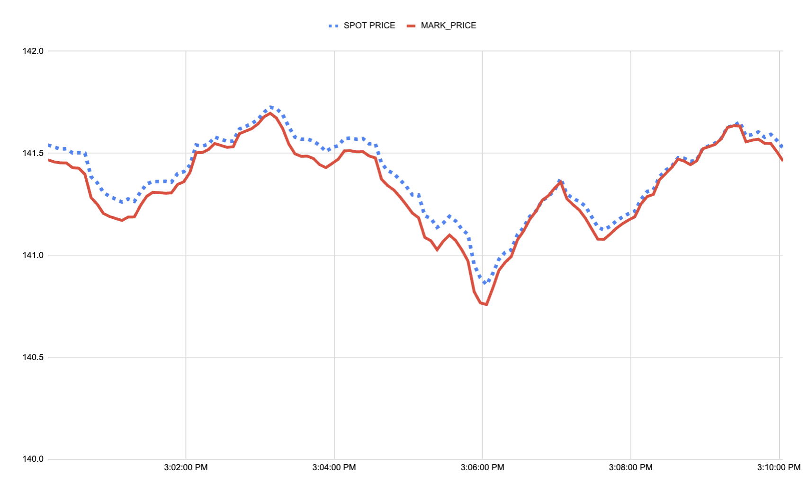
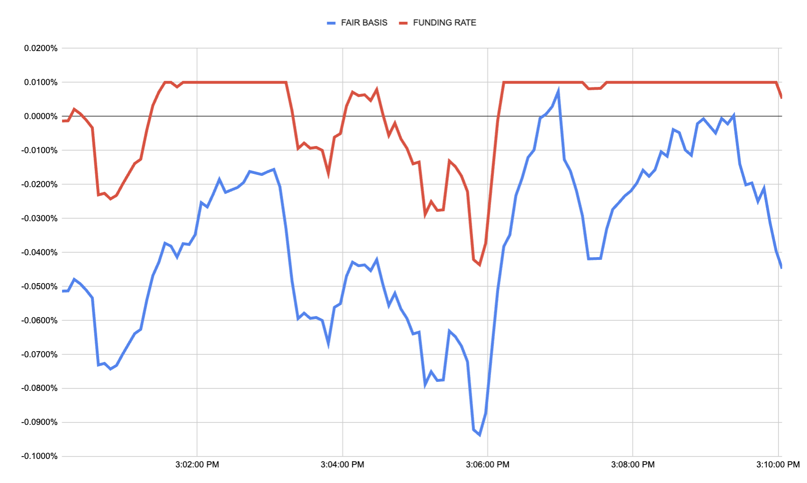

## **Perpetual Mark Price Formula**

The mark price of a perpetual future instrument is calculated as :

$$
\text{Mark Price}=\text{Spot Oracle Price}*(1+\text{Fair Basis})
$$

where :

$$\text{Spot Oracle Price}$$ is an external oracle price of the underlying coin obtained via the [Pyth](https://pyth.network/price-feeds) & [Stork](https://www.stork.network/) Networks.

## Fair Basis

Fair Basis measures how rich or cheap the perp is versus spot. It is built from three sources, each treated as one vote:

- **On-venue quotes**: Paradex best bid, best ask, and last trade, each expressed as a basis $(\text{price} - \text{spot}) / \text{spot}$.
- **On-venue mid**: basis computed from the Paradex bid/ask mid.
- **External venues**: per-venue basis $(\text{venue mark} - \text{spot}) / \text{spot}$ for each external venue (Binance, Bybit, OKX, Hyperliquid, and Lighter).

All inputs are EWMA-smoothed before use. The smoothed bases are then combined through two successive medians so no single feed can dominate:

$$
\begin{aligned}
& \text{InternalBasis} = \text{median}\big( \text{BidEWMA},\ \text{AskEWMA},\ \text{TradeEWMA} \big) \\
& \text{ExternalMedian} = \text{median}\big( \text{basis}_{\text{venue}_1},\ \text{basis}_{\text{venue}_2},\ \ldots \big) \\
& \text{LiquidBasis} = \text{median}\big( \text{InternalBasis},\ \text{MidEWMA},\ \text{ExternalMedian} \big)
\end{aligned}
$$

The published Fair Basis blends the external median with the liquid basis, weighted by an on-venue liquidity score $w \in [0, 1]$:

$$
\text{Fair Basis} = (1 - w) \times \text{ExternalMedian} + w \times \text{LiquidBasis}
$$

### Liquidity weight

A tick is *liquid* when both bid and ask are present and the relative spread is within the per-market Max Top-of-book Spread (default 1%). The weight $w$ ramps linearly toward 1 on liquid ticks and toward 0 on illiquid ticks, traversing the full 0-to-1 range over 30 minutes of sustained conditions.

Sustained thinness drives $w \to 0$ and Fair Basis follows external consensus; sustained tightness drives $w \to 1$ and on-venue signals regain equal weight.

## Calculate the Mark Price

The Mark Price is obtained by applying the Fair Basis to the Spot Price:

<Frame caption="SOL-USD-PERP mark price compared to the underlying spot price">

</Frame>

Note that the **Fair Basis** is different from the **Funding Rate**; the Funding Rate is derived from the Fair Basis using the formula [described here](funding-mechanism).

<Frame caption="SOL-USD-PERP fair basis and funding rate">

</Frame>
