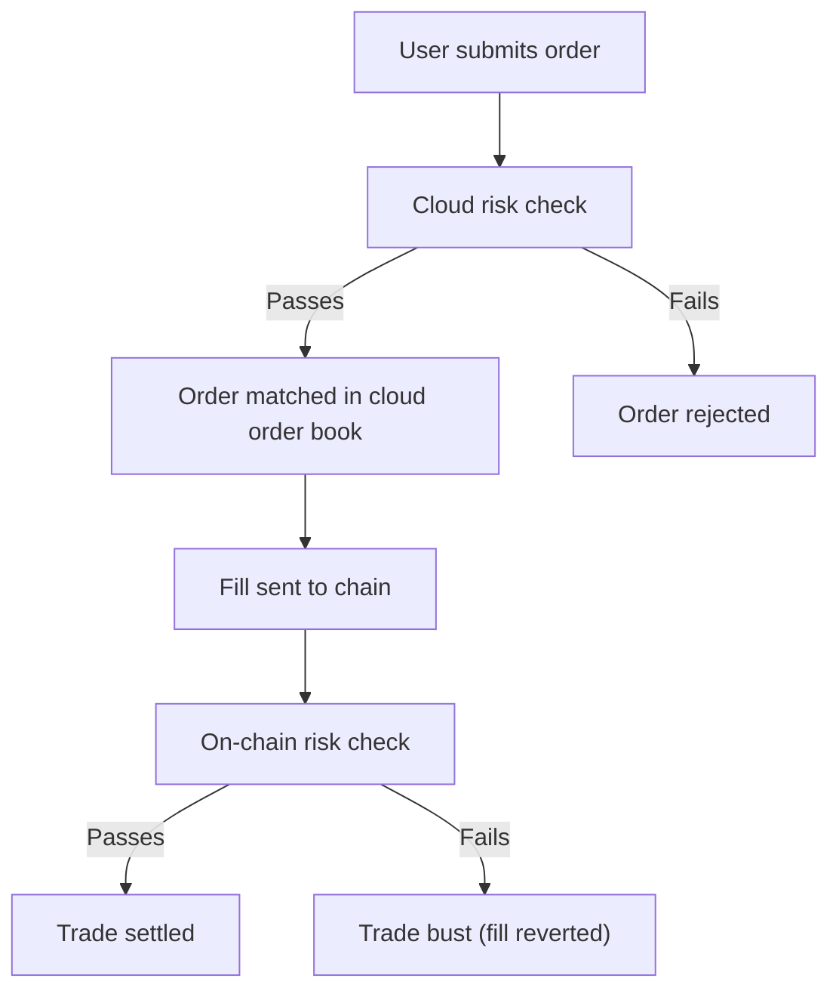

Paradex is a hybrid system where the matching engine runs in the cloud and the chain independently validates each trade. If a matched trade fails on-chain validation, it results in a **trade bust**.

## Trade flow

<Steps>
  <Step title="Order submission">
    The cloud matching engine checks whether the order would cause the account to exceed the [Initial Margin Requirement](cross-margin-requirement#initial-margin-requirement-imr), considering the full portfolio (collateral, positions, and orders) and market data (oracle prices, funding rates). Orders that violate the requirement are rejected. See [Order Risk Check](paradex-risk-checks#order-risk-check) for details.
  </Step>
  <Step title="Order matching">
    When the order matches against another order in the cloud order book, a fill is sent to the chain. Off-chain balances update immediately so the user can continue trading without waiting for on-chain confirmation.
  </Step>
  <Step title="On-chain validation">
    The chain independently verifies the new account composition against the Initial Margin Requirement. If the trade violates it, the chain rejects the fill. The cloud is typically more conservative, so rejections are uncommon.
  </Step>
</Steps>

## Trade busts

A trade bust occurs when the chain rejects a trade that was already matched off-chain. The off-chain account data is then reverted to undo the impact of the invalid trade.

<Note>
Paradex continuously works to minimize trade bust occurrences through tighter alignment between off-chain and on-chain risk checks.
</Note>

### Why busts happen

- **Rounding differences.** The cloud and chain use different rounding logic in their margin checks. These small numerical differences can cause a trade to fail on-chain, especially for orders trading close to the margin boundary.
- **Counterparty failure.** A trade involves two parties. Even if your account passes risk checks, the trade can bust if the counterparty's account fails on-chain margin validation.
- **Reduce-only conflicts.** An order marked as `reduce_only` can bust when other order events (fills or cancellations) occur between matching and on-chain settlement, making the `reduce_only` constraint unsatisfiable.

### What happens during a bust

1. The chain rejects the fill.
2. Off-chain balances and positions are reverted.
3. Affected orders return to their pre-trade state.

### Cascading busts

When a bust occurs, other trades from the same account may already be inflight to the chain. The bust changes the on-chain state, invalidating the risk checks the cloud performed for those inflight trades. This can cause a series of consecutive busts for the same account.

### Account resync

When the system detects a mismatch between the off-chain and on-chain state of an account, it automatically places the account into **RESYNC** mode. Resync synchronizes the off-chain state with the on-chain state to stop new busts from being generated. Trades already inflight to the chain will still bust since they were submitted before the resync began.
