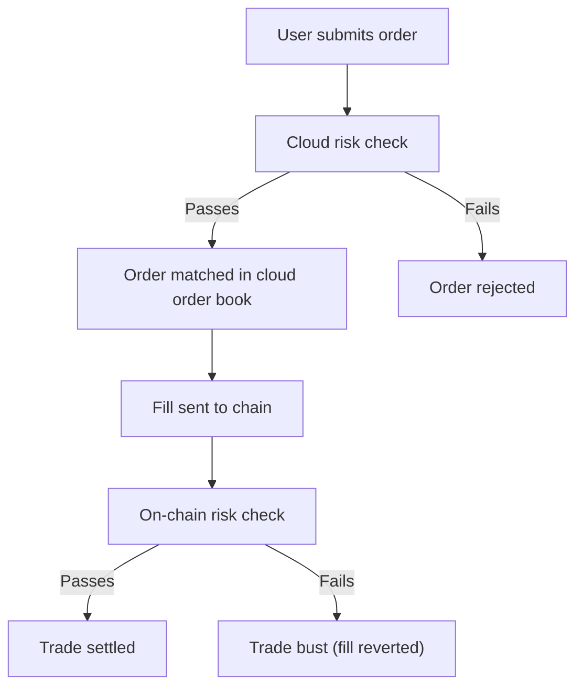

Paradex is a hybrid trading system with off-chain (cloud) and on-chain components. The matching engine runs in the cloud for performance, while the chain provides independent trade validation. In rare cases, a trade that passes off-chain checks can be rejected on-chain, resulting in a **trade bust**.

## Trade flow

<Steps>
  <Step title="Order submission">
    A user submits an order to the cloud matching engine. The cloud evaluates whether the order would cause the account to exceed risk limits, specifically the [Initial Margin Requirement](cross-margin-requirement#initial-margin-requirement-imr). This check considers the full portfolio composition (collateral, positions, and orders) along with market data such as oracle prices and funding rates.

    If the account would violate the requirement, the order is rejected. See [Order Risk Check](paradex-risk-checks#order-risk-check) for details.
  </Step>
  <Step title="Order matching">
    When the order crosses against a matching order in the cloud order book, a fill is generated and sent to the chain. Off-chain account balances update immediately, allowing the user to continue trading without waiting for on-chain confirmation.
  </Step>
  <Step title="On-chain validation">
    The chain independently verifies the new account composition. If the trade would cause the account to violate the Initial Margin Requirement, the chain rejects it even though the off-chain check passed.

    The cloud risk assessment is typically more conservative than the on-chain check, so rejections are uncommon.
  </Step>
</Steps>

## Trade busts

A trade bust occurs when the chain rejects a trade that was already matched off-chain. When this happens, the off-chain account data is reverted to undo the impact of the invalid trade.

<Note>
Paradex continuously works to minimize trade bust occurrences through tighter alignment between off-chain and on-chain risk checks.
</Note>

### Why busts happen

Trade busts can occur for several reasons:

- **Rounding differences.** The cloud and chain execute margin checks on the same data snapshots, but use different rounding logic. These small numerical differences can cause a trade to pass off-chain validation but fail on-chain, particularly for orders trading very close to the margin boundary.
- **Counterparty risk check failure.** A trade involves two parties. Even if your account passes risk checks, the trade can bust if the counterparty's account fails the on-chain margin validation.
- **Reduce-only order conflicts.** An order marked as `reduce_only` can bust when other order events (such as fills or cancellations) occur between matching and on-chain settlement, causing the `reduce_only` constraint to no longer be satisfiable.

### What happens during a bust

1. The chain rejects the fill during on-chain validation.
2. Off-chain balances and positions are rectified to revert the invalid trade.
3. Affected orders return to their pre-trade state.

### Cascading busts

When a trade bust occurs, other trades from the same account may already be inflight to the chain. Because the bust changes the account's on-chain state, the risk checks that the cloud performed for those inflight trades are no longer valid since the initial conditions have changed. This can cause a series of consecutive busts for the same account.

### Account resync

When a trade bust occurs due to a mismatch between off-chain and on-chain values, the account is automatically placed into **RESYNC** mode. During resync, the system synchronizes the off-chain state with the on-chain state to prevent further busts from being generated. However, trades that are already inflight to the chain will continue to bust since they were submitted before the resync began.
