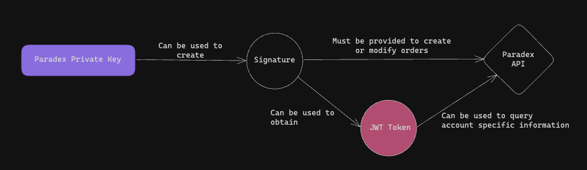
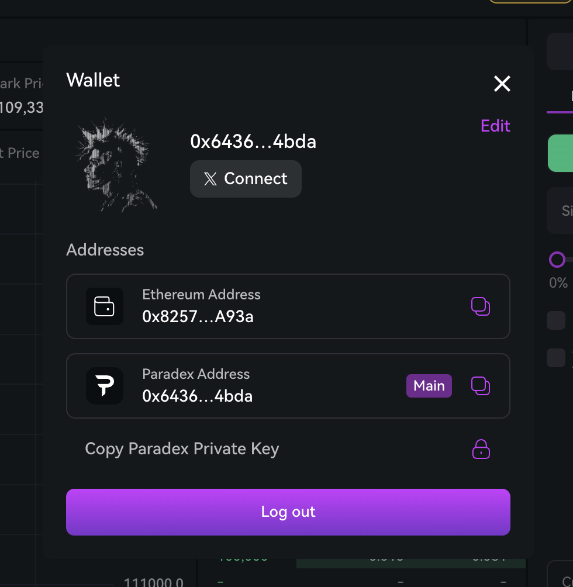
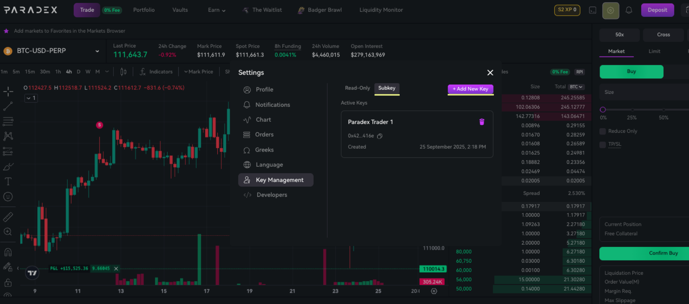
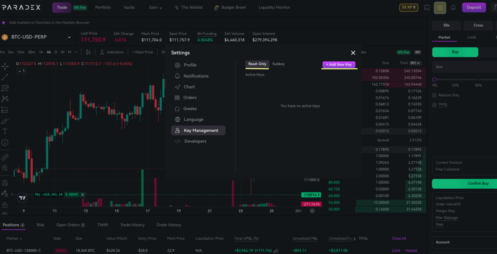

API keys allow you to interact with the Paradex trading system programmatically without using the web interface.
This guide covers how to generate and manage different types of credentials for trading, monitoring, and API access.

There are 2 general types of credentials used to authenticate with the Paradex API
1. JWT Tokens - JWT (JSON Web Tokens) are secure tokens that contain encoded information about your permissions. They grant access to most API endpoints that are non-public and are included in every request to the API.
2. Private Keys - Grant full trading access. Private keys are used both for creating JWT Tokens and Signatures, which are both sent to the API to place orders. 



## Full Trading Access
In order to enable full trading access via API, users need to export a Private Key associated with their account.
This can either be:
1. Main Private Key
2. [Subkey](#subkeys)

Please refer to the SDK documentation on how to use your Private key to interact with on Paradex via API.
- [paradex-py](https://github.com/tradeparadex/paradex-py)
- [paradex-js](https://github.com/tradeparadex/paradex.js)

<Info>
For detailed API documentation, see our [API Reference](/developer-portal/general-information/api-reference).
</Info>

### Private Keys
The account's Private key can be obtained on the UI on the Wallet tab



Click on 'Copy Private Key' to obtain your account's main private key.

<Warning>
Access to the Main Private Key grants the ability to Withdraw and Transfer funds from the user's account. This should never be exposed.
For a safer alternative, use Subkeys.
</Warning>

### Subkeys

Subkeys are private keys for an account with scoped down permissions. Unlike your main private key, Subkeys
do not have permissions to perform Withdrawals, Transfers, and manage sensitive account settings.

However, as private keys, they are still fully capable of creating/modifying orders and interacting with the API.

These keys provide a secure way to delegate trading permissions while maintaining control over account security.

<CardGroup cols={2}>
  <Card title="Trading Permissions" icon="fa-regular fa-chart-line">
    Can place and manage orders
  </Card>
  <Card title="Restricted Transfers" icon="fa-regular fa-ban">
    Cannot withdraw funds or transfer to other accounts
  </Card>
  <Card title="Account Isolation" icon="fa-regular fa-shield">
    Operate within specific account parameters
  </Card>
  <Card title="Enhanced Security" icon="fa-regular fa-lock">
    Separate from main account private key
  </Card>
</CardGroup>

### Permissions

<AccordionGroup>
  <Accordion title="Subkeys Can">
    - Place buy and sell orders
    - Cancel existing orders
    - Modify order parameters
    - Access account balance and positions
    - View order history and trade data
    - Access market data and pricing
  </Accordion>
  <Accordion title="Subkeys Cannot">
    - Withdraw funds from the account
    - Transfer funds to other accounts
    - Modify account settings
    - Manage Subkeys
  </Accordion>
</AccordionGroup>

#### Use Cases

- **Programmatic Trading**: Trade via API without risk of exposing your main Private Key.
- **Automated trading bots**: Deploy trading strategies without full account access
- **Third-party integrations**: Allow trusted applications to trade on your behalf
- **Team trading**: Enable multiple team members to trade with controlled permissions

#### Creating Subkeys

1. Navigate to account security settings and locate Key Management
2. Click on the 'Subkeys' toggle, then click on '+ Add New Key'

3. Give your subkey a name
4. Generate and securely store your subkey private key. The private key is not stored on the server and will only be shown once.
5. The public key component can be copied on the Subkeys tab. This public key can also be derived from the private key.
6. To revoke a Subkey, click on the Delete button next to the token on the Subkeys tab

#### Using Subkeys
Subkeys behave like regular private keys. They are used for
- Getting JWT Tokens from the `/auth/:public_key` [endpoint](api/general-information/authentication)
- Signing requests to [create/modify orders](/api/prod/orders/new)

#### Generating Auth Tokens
While using a subkey:
- The Subkey's public key must be provided to the auth endpoint `/auth/{public_key}`
- The `PARADEX-STARKNET-ACCOUNT` header should be the address of the main account
- The `PARADEX-STARKNET-SIGNATURE` must be generated by signing using the subkey private key.

<Note>
The main account address is required because subkeys are randomly generated keypairs registered to your account. Since we cannot derive the account address from a subkey's private key, we must specify which account the subkey belongs to.
Additionally, we need to specify the subkey's public key so it can be used for signature verification instead of defaulting to the main account's public key.
</Note>

## Readonly Access
In order to query most APIs with account related information, a JWT Token needs to be attached to the auth headers of the request.

### Readonly Tokens
Readonly Tokens are special JWT Tokens with extended expiry dates.
Readonly tokens provide secure, read-only access to your account data and market information. These tokens are ideal for building monitoring dashboards, creating trading analytics tools, implementing risk management systems, and developing market data applications.

Since these are JWT tokens, they do not grant trading access. They are also restricted to GET requests and cannot be used to modify account information.
<CardGroup cols={2}>
  <Card title="Read-only Access" icon="fa-regular fa-eye">
    Cannot place orders or modify account settings
  </Card>
  <Card title="Revocable" icon="fa-regular fa-trash">
    Can be revoked at any time for security
  </Card>
</CardGroup>

### Permissions

Readonly tokens can access most GET endpoints on the API, including:

- Real-time portfolio monitoring and balance information
- Order history and execution status
- Market data and pricing information
- P&L tracking and trade execution details

<Note>
While JWT Tokens have reduced scope, they should still be stored securely and should be rotated regularly.
</Note>

### Creating Readonly Tokens

1. Navigate to account settings and locate the Key Management Section
2. While on the 'Read-only' tab, click "+ Add New Key"



3. Configure key settings (name and expiration)
4. Generate and securely store your API key. Note that this key will only be shown to you once and cannot be recovered after.
5. To revoke a Readonly token, click on the Delete button next to the token on the Read-only tab

### Using Readonly Tokens
Readonly tokens can be used just like regular auth tokens in API calls to the platform:

Use your newly generated API token in GET requests to the API
```bash
curl -X GET "https://api.prod.paradex.trade/v1/balance" \
  -H "Authorization: Bearer <READONLY-TOKEN>" \
  -H "Content-Type: application/json"
```

## Summary
Paradex offers three main types of API credentials:

- **Readonly Tokens**: Provide read-only access to account data and market information
- **Subkeys**: Private keys with trading permissions but restricted from withdrawals and transfers
- **Paradex Private Key**: This is your account's main private key. Users with this credential have full access to all account features.

These credentials all enable programmatic access to the Paradex API.

## Credential Comparison

| Feature | Readonly Tokens | Subkeys | Private Keys |
|---------|----------------|---------|--------------|
| **Access Level** | Read-only | Trading only | Full account access |
| **Can Place Orders** | ❌ No | ✅ Yes | ✅ Yes |
| **Can Withdraw/Transfer** | ❌ No | ❌ No | ✅ Yes |
| **Can Modify Account** | ❌ No | ❌ No | ✅ Yes |
| **Authentication Method** | Bearer token | Private key signing | Private key signing |
| **Use Cases** | Monitoring, analytics | Automated trading | Full account management |
| **Security Risk** | Low | Medium | High |
| **Revocable** | ✅ Yes | ✅ Yes | ❌ No (requires account migration) |
