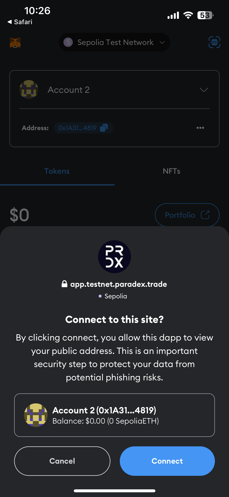

<Info>
If you are not using email or social logins for your Paradex account, you will need your wallet mobile app installed on your device to login.

If your wallet does not offer mobile apps (eg. Rabby), you will not be able to use our Paradex mobile app. We are actively working on alternative login methods for this use case.
</Info>

## Option 1: Native Mobile App

<CardGroup cols={2}>
  <Card title="iOS" icon="fa-brands fa-apple" href="https://apps.apple.com/app/paradex/id6741532722">
    Download on the App Store
  </Card>
  <Card title="Android" icon="fa-brands fa-android" href="https://play.google.com/store/apps/details?id=com.paradex.paradexapp">
    Get it on Google Play
  </Card>
</CardGroup>

## Option 2: Progressive Web App (PWA)

<AccordionGroup>
  <Accordion title="iOS">
    <Steps>
        <Step title="Go to Paradex">
            On your browser
            <CardGroup cols={2}>
                <Card title="Mainnet" icon="circle-m">
                    https://app.paradex.trade/
                </Card>
                <Card title="Testnet" icon="circle-t">
                    https://app.testnet.paradex.trade/
                </Card>
            </CardGroup>
        </Step>
        <Step title="Tap Share">
            Tap on the share button at the bottom of your phone screen
        </Step>
        <Step title="Add to Home Screen">
            Select "Add to Home Screen"
        </Step>
        <Step title="Installed">
            You will now see the Paradex App added to your phone screen
        </Step>
    </Steps>
  </Accordion>
  <Accordion title="Android">
    <Steps>
        <Step title="Go to Paradex">
            On your browser
            <CardGroup cols={2}>
                <Card title="Mainnet" icon="circle-m">
                    https://app.paradex.trade/
                </Card>
                <Card title="Testnet" icon="circle-t">
                    https://app.testnet.paradex.trade/
                </Card>
            </CardGroup>
        </Step>
        <Step title="Tap on 3-dot icon">
            Tap on the 3-dot icon at the top right hand corner of your screen
        </Step>
        <Step title="Add to Home Screen">
            Select "Add to Home Screen"
        </Step>
        <Step title="Install">
            Select "Install"
        </Step>
        <Step title="Installed">
            You will now see the Paradex App added to your phone screen
        </Step>
    </Steps>
  </Accordion>
</AccordionGroup>

## Setting up your account

<Steps>
    <Step title="Connect Wallet">
        Click button `Connect Wallet`
        <Frame>
        

        
        

        </Frame>
    </Step>
    <Step title="Choose Wallet">
        

        <Frame>
        
        </Frame>
        

    </Step>
    <Step title="Tap Wallet">
        Tap on `MetaMask` or any other wallet you use
        

        <Frame caption="Connect to MetaMask">
        
        </Frame>
        

    </Step>
    <Step title="Redirected to Wallet App">
        You will be then directed to MetaMask mobile app
        

        <Frame caption="MetaMask app redirect">
        
        </Frame>
        

    </Step>
    <Step title="Connect to Paradex">
        Click `Connect` to Paradex
        

        <Frame caption="Connect to Paradex">
        
        </Frame>
        

    </Step>
    <Step title="Generate Private Key">
        Click `Continue` to Generate your L2 Private Key
        

        <Frame>
        
        </Frame>
        

    </Step>
    <Step title="Sign Private Key">
        Click `Sign` to sign the creation of your L2 Private Key\
        The first time you connect the wallet, the signature will be requested twice to confirm your wallet produces stable signatures.

        

        <Frame>
        
        </Frame>
        

    </Step>
    <Step title="Start Trading">
        A deposit transfer of test funds should arrive shortly after onboarding the first time on Testnet. You are now set to explore Paradex platform and start trading!

        

        <Frame>
        
        </Frame>
        

    </Step>
</Steps>
