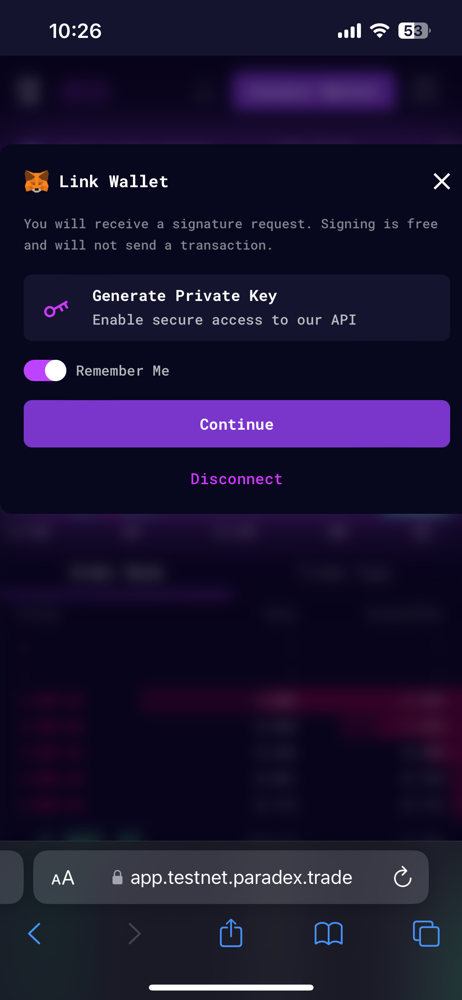

### Step 1 - Go to Mainnet or Testnet app

<Info>
To access Paradex Mainnet, enter url: app.paradex.trade

To access Paradex Testnet, enter url: app.testnet.paradex.trade
</Info>

<Info>
You can use any browser. Including, but not limited to: Safari, Chrome and MetaMask Browser. You will need MetaMask installed on your device if you are using a MetaMask wallet.
</Info>

### Step 2 - Choose and Connect Wallet

1. Click button `Connect Wallet`

<Frame>

</Frame>

2. Click `Choose Wallet` to choose your wallet

<Frame>

</Frame>

3. Click on `MetaMask` or any other wallet you use

<Frame caption="Connect to MetaMask"> 

</Frame>

4. You will be then directed to MetaMask mobile app

<Frame caption="MetaMask app redirect">

</Frame>

5. Click `Connect` to Paradex

<Frame caption="Connect to Paradex">

</Frame>

### Step 3 - \[Testnet] Switch network to Sepolia Testnet

By default, your MetaMask wallet could be using Ethereum Main Network. To access Tesnet app, switch to Sepolia Test Network. In your wallet, click Switch Network to switch to Sepolia Tesnet.

<Info>
Ignore this step if you are accessing the Mainnet app on Ethereum Main Newtork.
</Info>

<Frame caption="Switch to Sepolia">

</Frame>

### Step 4 - Generate Private Key

Click `Continue` to Generate your L2 Private Key

<Frame>

</Frame>

### Step 5 - Sign Private Key

Click `Sign` to sign the creation of your L2 Private Key\
The first time you connect the wallet, the signature will be requested twice to confirm your wallet produces stable signatures.

<Frame>

</Frame>

### Step 6 - Start Trading

A deposit transfer of test funds should arrive shortly after onboarding the first time on Testnet. You are now set to explore Paradex platform and start trading!

<Frame>

</Frame>

