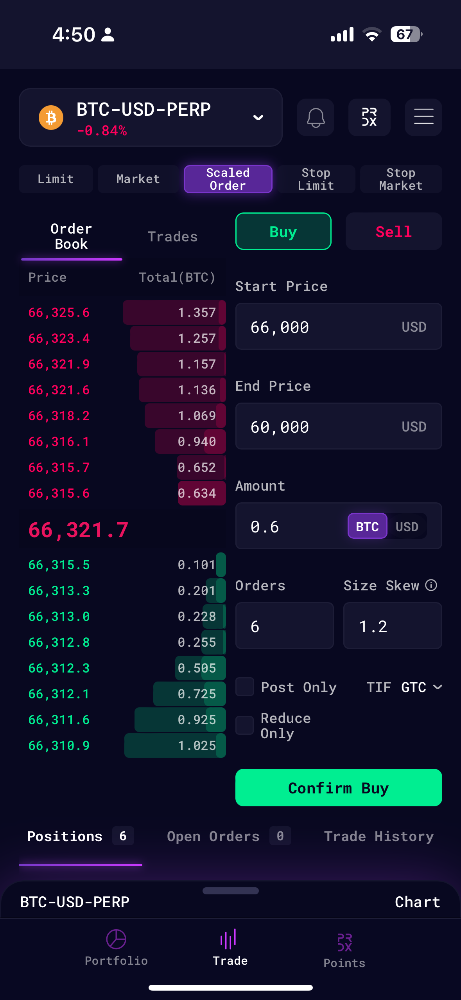

## How to submit a scaled order?

1. Select the market that you wish to trade
2. Select "Scaled Order" under the order types
3. Input the parameters of the scaled order
   1. **Buy / Sell** - Trade direction
   2. **Start Price & End Price** - Scaled order range
   3. **Amount** - Total amount of the order sizes to be submitted
   4. **Total Orders** - Number of orders to be submitted
   5. **Skew** - Ratio of End Order Amount / Start Order Amount

## Scaled Order on [Mobile](../../../getting-started/install-mobile-desktop-app/mobile-app)

<Frame caption="Mobile version: Select 'Scaled Order' and enter the parameter">

</Frame>

## Scaled Order on [Desktop](../../../getting-started/install-mobile-desktop-app/desktop-app)

<Frame caption="Select 'Scaled Order' from the dropdown">

</Frame>
 
<Frame caption="Enter the Scaled Order Parameters">

</Frame>

<Frame caption="Scaled orders submitted will show up on the Open Orders tab if successful">

</Frame>
