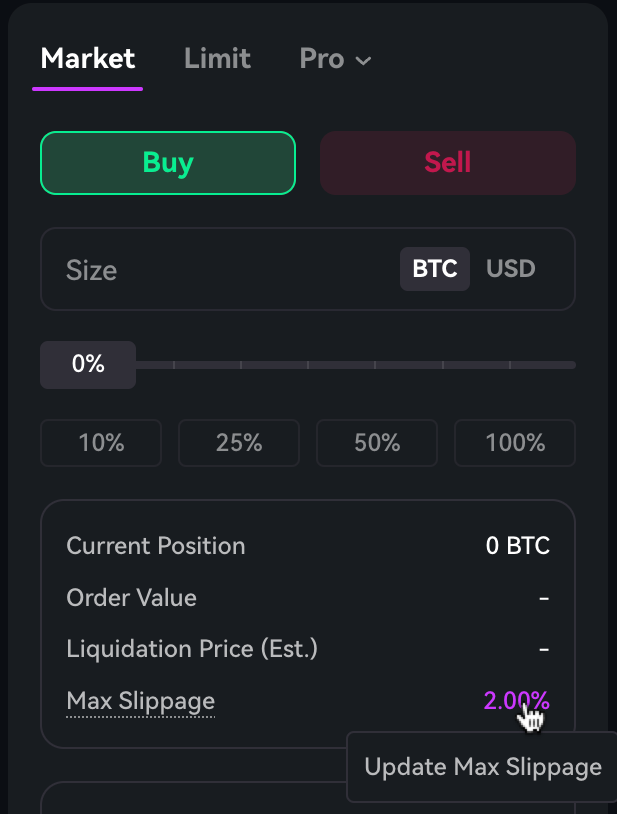
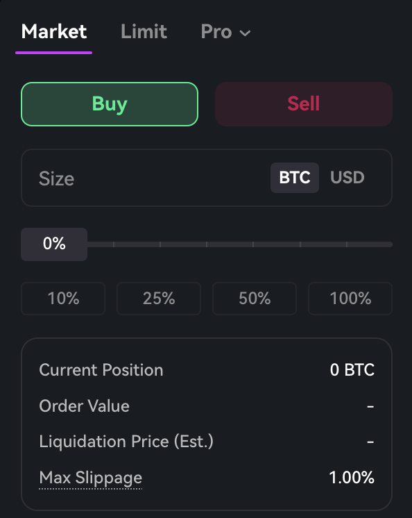

## Max Slippage  

**Max slippage** defines the largest acceptable price deviation from the mark price. During execution, an order will be canceled if the price exceeds the slippage limit or falls outside the market [Price Bands](https://docs.paradex.trade/documentation/risk-system/price-bands).

--- 

## How to Update Max Slippage  
1. Navigate to the **Trade** section of the UI

2. Locate the **Order** section, and click on the Max Slippage value

<Frame>
  
</Frame>

3. Some markets have max cap of slippage percentage (In this case BTC-USD-PERP has max slippage of 2%)

<Frame>
  
</Frame>

4. Adjust the slippage tolerance to your preferred percentage. You can use decimals as well as long as it is within max slippage of each market, example : 0.5% works since it is below 2% for BTC-USD-PERP.

<Frame>
  
</Frame>

5. Click confirm to save the slippage setting

<Frame>
  
</Frame>