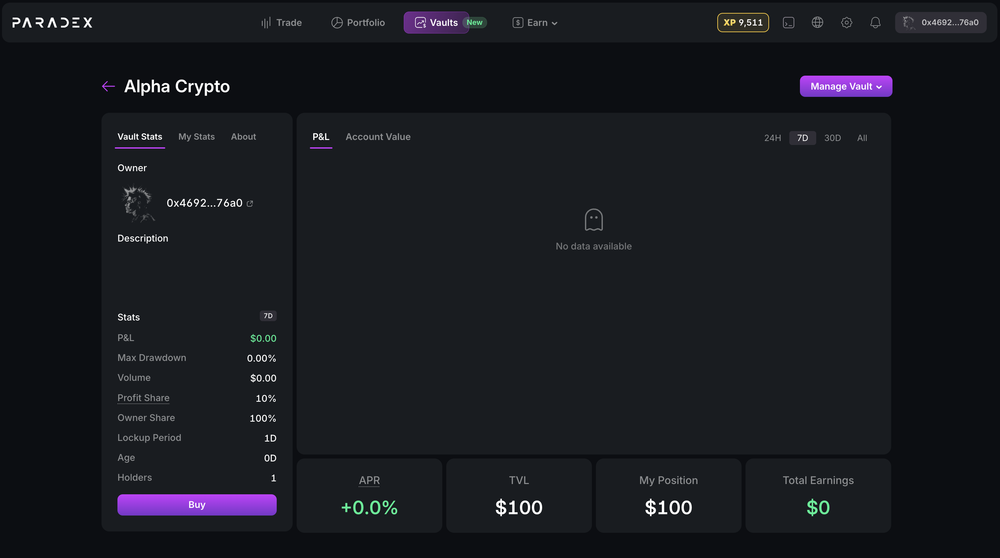
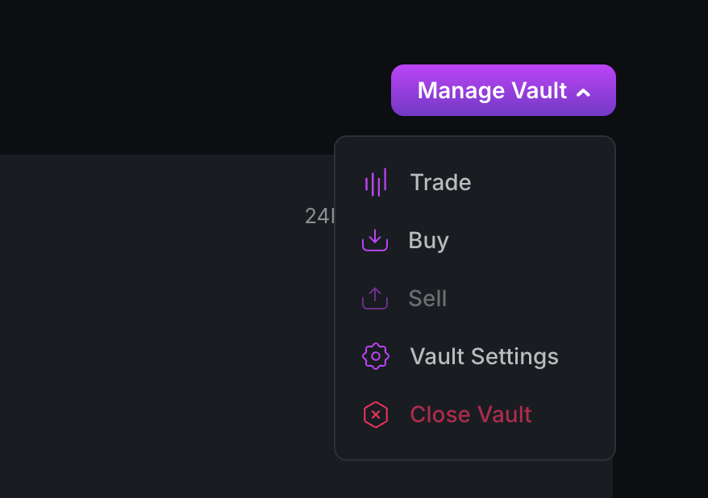
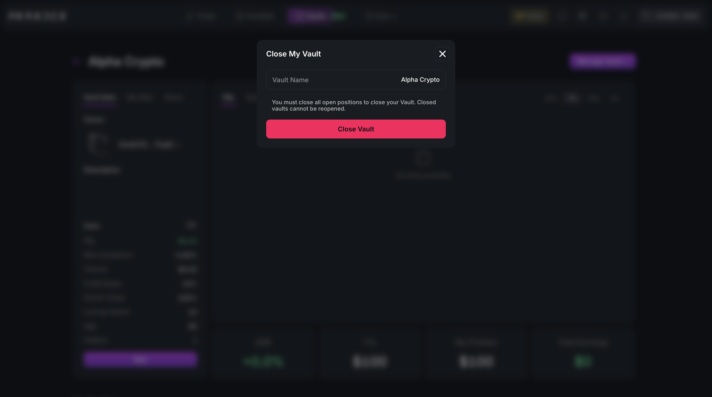
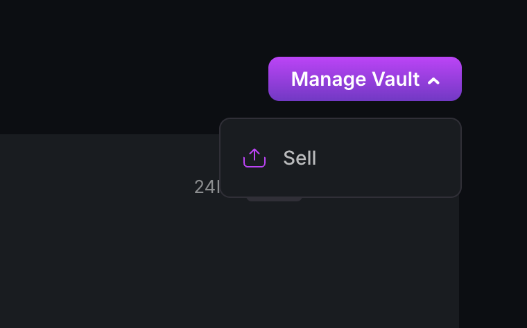
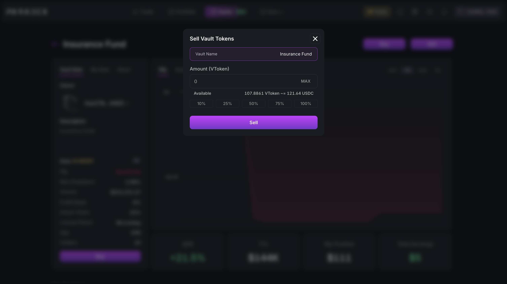

**Step 1:** On the top right corner, click on the "Manage Vault" button.

<Frame>
  
</Frame>

**Step 2:** Under "Manage Vault", click on "Close Vault".

<Frame>
  
</Frame>

**Step 3:** Type in your Vault Name to close your vault.

<Frame>
  
</Frame>

**Step 4:** Once the Vault is closed, the click on "Manage Vault" again and
click "Sell" to sell your vault tokens.

<Frame>
  
</Frame>

**Step 5:** Enter the token amount and click "Sell".

<Frame>
  
</Frame>

After you have completed the steps above, you will receive USDC in your main
account.
