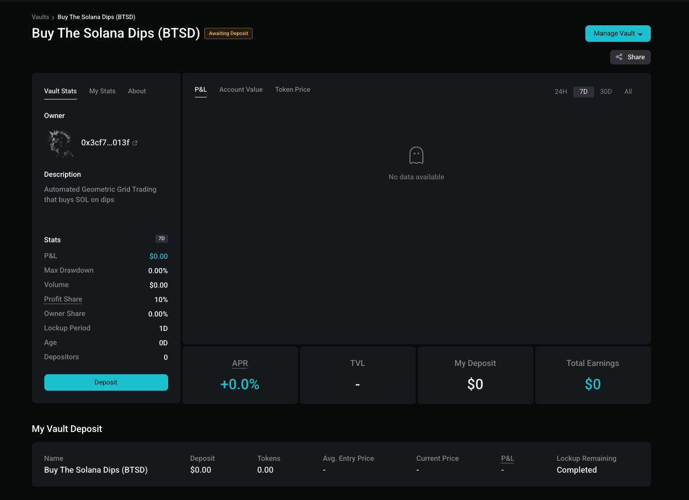
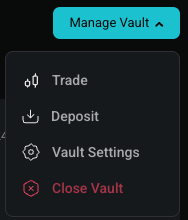
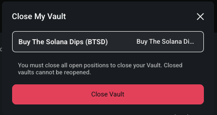
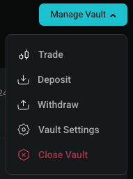
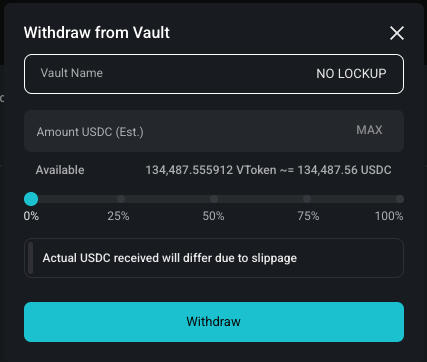

<Steps>
  <Step title='Click "Manage VTF"'>
    On the top right corner, click on the "Manage VTF" button.

    
  </Step>

  <Step title='Click "Close VTF"'>
    Under "Manage VTF", click on "Close VTF". Type in your VTF Name to close your VTF.

    

      
      
    

  </Step>

  <Step title='Withdraw from VTF'>
    Once the VTF is closed, click on "Manage VTF" again and click "Withdraw" to withdraw from your VTF.

    
  </Step>

  <Step title='Confirm Withdrawal'>
    Enter the amount and click "Withdraw (USDC)". You will receive USDC in your main account.

    
  </Step>
</Steps>
