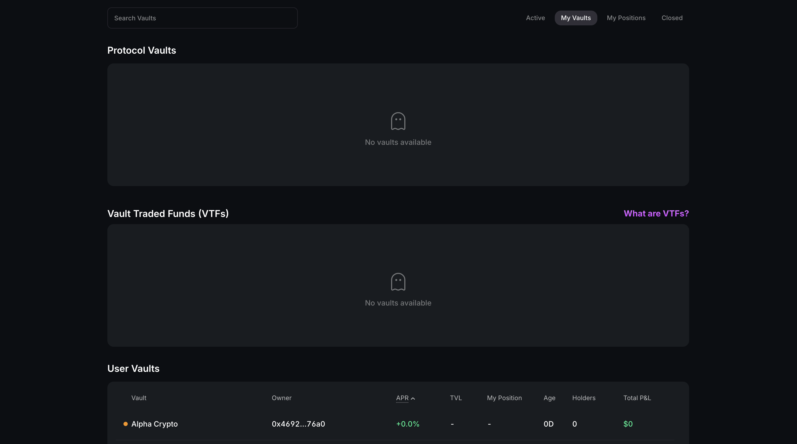
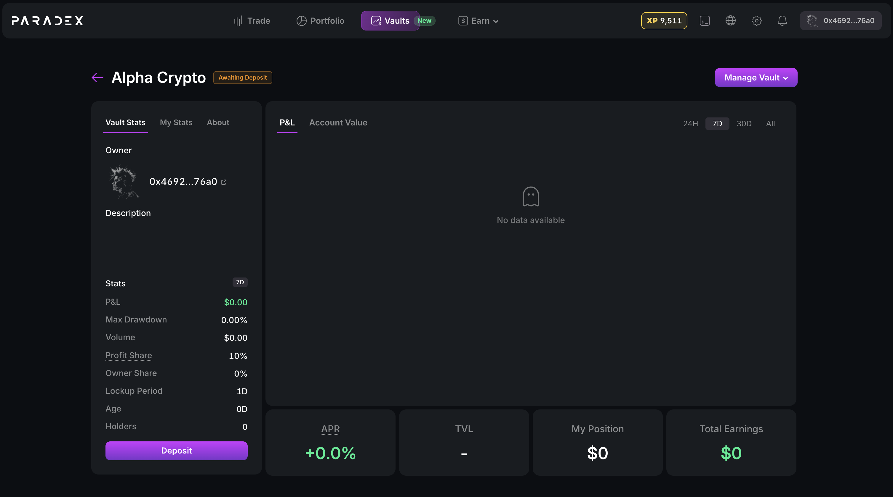

**Step 1:** Go to
[https://app.paradex.trade/vaults](https://app.paradex.trade/vaults), click on
the "Create" button on the top right hand corner.

<Frame>
  
</Frame>

**Step 2:** Enter the details to Create your Vault and click _Create_

<Frame>
  
</Frame>

**Step 3:** Find your vault by clicking _My Vaults_ filter and click it to go to
the vault page

<Frame>
  
</Frame>

**Step 4:** Click _Deposit_ and follow the steps to activate your vault

<Frame>
  
</Frame>
