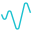

  

    {/* ── 1. HERO ── */}
    

      

        Trade 24/7
        

          

            Futures
            Options
            Spot
            Commodities
          

        

        With Privacy
      

      

        <a className="fern-button filled normal primary rounded gap-1 lp-btn" href="https://app.paradex.trade">
          Start Trading
        </a>
        <a className="fern-button outlined normal rounded gap-1 lp-btn" href="/docs">
          Explore the Docs
        </a>
      

    

    {/* ── 2. VALUE PROPS ── */}
    

      <a className="lp-value-card" href="/trading/privacy">
        
          
        
        <h3 className="lp-value-title">Privacy</h3>
        
Positions, entries, PnL and liquidation levels are hidden from the public.

      </a>
      <a className="lp-value-card" href="/risk/margin-system">
        
          
        
        <h3 className="lp-value-title">Unified Margin</h3>
        
Trade 90+ markets across Futures, Spot, and Options all in one account.

      </a>
      <a className="lp-value-card" href="/risk/socialized-losses">
        
          <Icon icon="fa-sharp fa-thin fa-shield" />
        
        <h3 className="lp-value-title">No ADL</h3>
        
No Auto-Deleveraging. Socialized loss distributes risk fairly and preserves portfolio integrity.

      </a>
    

    {/* ── 3. CHOOSE YOUR PROFILE ── */}
    

      

        Choose your trader profile
      

      

        <a className="lp-profile-card" href="/trading/trader-profiles">
          <h3 className="lp-profile-name">Pro</h3>
          
Fast Lane

          
Paid taker fee, priority execution, and FastFills discounts for API traders who match with retail orders.

          <ul className="lp-profile-list">
            <li>Priority execution</li>
            <li>FastFills discounts</li>
            <li>High rate limits</li>
          </ul>
        </a>
        <a className="lp-profile-card" href="/trading/trader-profiles">
          <h3 className="lp-profile-name">Retail</h3>
          
Standard Lane

          
Standard execution with access to RPI liquidity and queue priority.

          <ul className="lp-profile-list">
            <li>RPI liquidity</li>
            <li>UI queue priority</li>
          </ul>
        </a>
      

      

        Both lanes get:✓ <strong>Privacy</strong>✓ <strong>90+ markets</strong>✓ <strong>Unified margin</strong>
      

      

        <a className="fern-button minimal normal gap-1 lp-btn" href="/trading/rpi">Retail Price Improvement →</a>
        <a className="fern-button minimal normal gap-1 lp-btn" href="/trading/fastfills">FastFills →</a>
      

    

    {/* ── 4. AUDIENCE CARDS ── */}
    

      {/* Trade */}
      

        

          Trade on Paradex
          
Get started trading perps, spot, options, and vaults.

        

        

          <a className="lp-pill" href="/trading/privacy">Privacy</a>
          <a className="lp-pill" href="/trading/spot-trading/supported-order-types">Spot</a>
          <a className="lp-pill" href="/trading/dated-options/overview">Options</a>
          <a className="lp-pill" href="/docs/vaults/vaults-introduction">Vaults</a>
        

        

          <a href="/home">Getting started →</a>
          <a href="/docs/getting-started/bridges">Bridges and on-ramps →</a>
          <a href="/trading/orders/placing-orders">Placing orders →</a>
          <a href="/risk">Margin and risk →</a>
          <a href="/trading/trading-fees">Trading fees →</a>
        

      

      {/* Build */}
      

        

          Build on Paradex
          
Integrate with the API, build bots, or deploy on Paradex Chain.

        

        

          <a className="lp-pill" href="https://tradeparadex.github.io/paradex-py/">Python SDK</a>
          <a className="lp-pill" href="/api">REST API</a>
          <a className="lp-pill" href="/ws">WebSocket API</a>
          <a className="lp-pill" href="https://github.com/tradeparadex/paradex-cli/">CLI</a>
          <a className="lp-pill" href="/agentic-ai-hub/mcp/quickstart">MCP</a>
        

        

          <a href="/api/general-information/authentication">API authentication →</a>
          <a href="/api/general-information/api-quick-start">API quick start →</a>
          <a href="/chain/paradex-chain-rpc-node">Paradex Chain RPC →</a>
          <a href="/docs/testnet-faqs">Testnet guide →</a>
          <a href="https://github.com/tradeparadex/code-samples">Code samples →</a>
        

      

    

    {/* ── 5. EXPLORE MORE ── */}
    

      

        Explore more
      

      

        <a className="lp-explore-card" href="/risk">
          
Risk and Liquidations

          
Margin system, funding, price bands, and deleveraging mechanics.

        </a>
        <a className="lp-explore-card" href="/docs/xp-referrals/xp">
          
XP and Referrals

          
Earn XP, climb the ranks, and refer friends for rewards.

        </a>
        <a className="lp-explore-card" href="/chain/security">
          
Security and Trust

          
Lockdown mode, guardian keys, audits, and bug bounty program.

        </a>
        <a className="lp-explore-card" href="/docs/vaults/vaults-introduction">
          
Vaults

          
Earn passive income with automated, multi-asset, multi-strategy products

        </a>
        <a className="lp-explore-card" href="/ecosystem">
          
Ecosystem

          
Community content, wallets, cross-chain bridges, and price oracles.

        </a>
        <a className="lp-explore-card" href="/chain">
          
Paradex Chain

          
Paradex's own appchain on Starknet. Explore the architecture and RPC access.

        </a>
      

    

  

