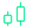
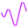

<embed class="w-full h-auto" src="../assets/superdex-banner.webp" type="image/png" />

<CardGroup cols={3}>
  <Card class="green-cards" title="Trade Any Asset" icon={}>
    Trade Futures, Options (Dated and Perpetual), Pre-markets and Spot
  </Card>

  <Card class="green-cards card-icon-w64" title="Zero Fee Perps" icon={}>
    Zero fees for retail traders (maker or taker) on 100+ Perpetual Futures markets
  </Card>

  <Card class="green-cards" title="Privacy" icon={}>
    Zk-encrypted accounts hide your positions, entries, exists, liquidation levels and PnL
  </Card>

  <Card class="purple-cards" title="Fastest Listings" icon={}>
    Trade new tokens before they list on major CEXs
  </Card>

  <Card class="purple-cards" title="Unified Margin" icon={}>
    Trade 250+ markets across Futures, Options (Dated and Perpetual) and Spot all in one account
  </Card>

  <Card class="purple-cards" title="Tokenized High Yield Vaults"  icon={}>
    Earn passive income with automated, multi-asset, multi-strategy products
  </Card>
</CardGroup>

  <Button href="https://app.paradex.trade" intent="primary" large rounded>
    Trade on Paradex
  </Button>

  <Button href="/getting-started/roadmap" intent="primary" large rounded outlined>
    Explore Roadmap
  </Button>

